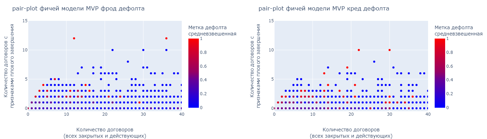
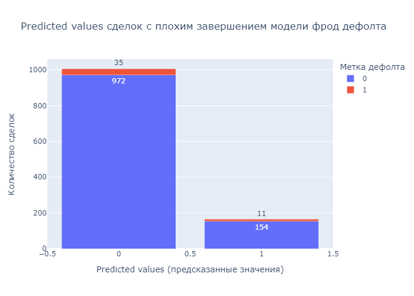
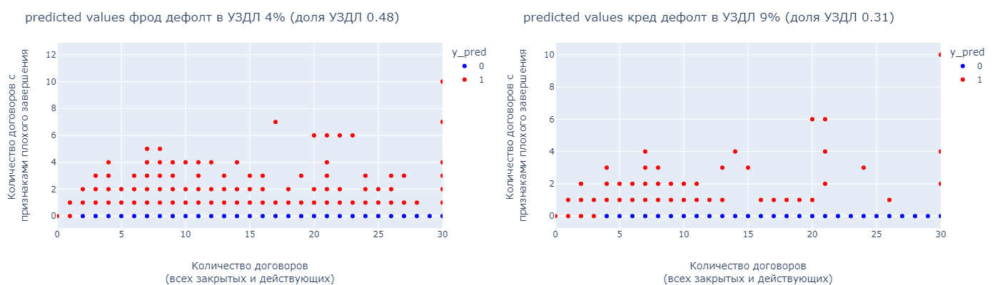
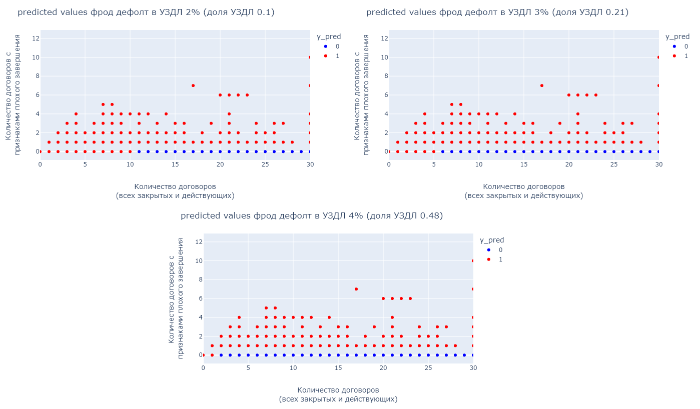
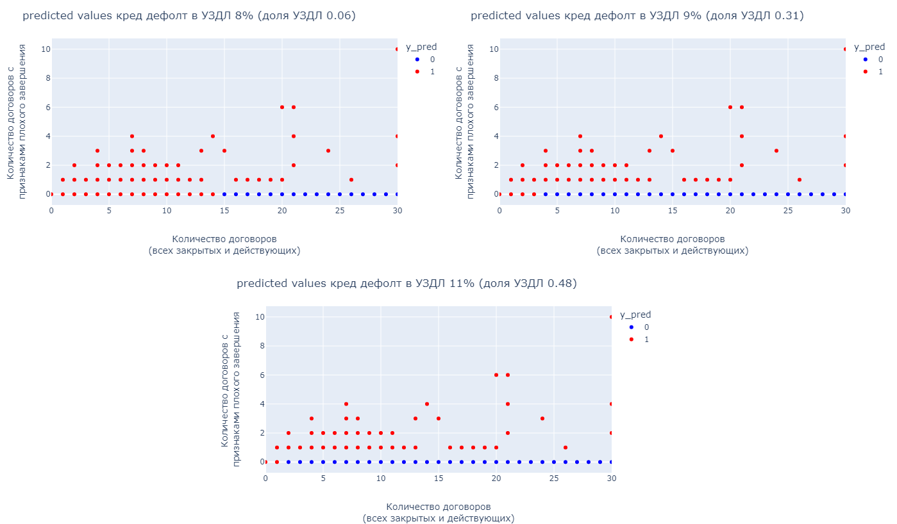

 
# ОТЧЕТ ПО МОДЕЛИ MVP С ИСПОЛЬЗОВАНИЕМ ДВУХ ФИЧЕЙ

 
## Постановка задачи

Модель MVP служит для маршрутизации процесса принятия решения по сделкам. Задачей модели является нахождение сделок, имеющих минимальную вероятность дефолта, которые в последующем будут одобряться по упрощенной схеме проверок (маршрут УЗДЛ). 

Код модели находится в файле src/mdm/MVP model/mvp_model.ipynb.

Возможными постановками задачи модели MVP могут быть 
1.	Минимизировать долю False-Negative (FN) в объеме сделок УЗДЛ при заданной доле сделок, которые необходимо направлять на упрощенное рассмотрение. То есть,
$min fn (k=K)$, 
где $fn$– доля дефолтных сделок, которые были определены моделью, как не дефолтные. 
$K$- Минимально необходимая доля сделок, направляемая на упрощенное рассмотрение, заданная заранее. 
$k$ – Фактическая доля сделок, направляемая на упрощенное рассмотрение, по результатам работы модели.

2. 	Максимизировать долю сделок УЗДЛ при заданном уровне максимально допустимой вероятности дефолта в доле сделок УЗДЛ. То есть,
$max k (fn≤FN)$, 
где $k$ - Фактическая доля сделок, направляемая на упрощенное рассмотрение, по результатам работы модели,
$fn$– доля дефолтных сделок, которые были определены моделью, как не дефолтные. 
$FN$ – максимально-допустимая доля дефолтных сделок, которые были определены моделью, как не дефолтные (False-Negative). 

В данной работе реализовывался второй вариант постановки задачи, то есть необходимо было обеспечить максимальный объем сделок УЗДЛ при уровне допустимой вероятности дефолта в доле сделок УЗДЛ не более заданного порога. Вероятность дефолта в объеме сделок УЗДЛ оценивается как доля дефолтных сделок относительно всех сделок в УЗДЛ по данным тестовой выборки. 

В качестве тестовой выборки использовались исторические данные с принятием решения в 2023 году. Более подробно алгоритм описан в разделе «Исходные данные».
 
## Исходные данные

В качестве исходных данных для модели были взяты данные АО «Компании 1» c 01 января 2020 года. Из данных брались:
- классификационные признаки метки кред и фрод дефолта, проставленными на 01.07.2022, 
- признак «попадает в выборку», 
- с учетом суммы финансирования (сделки по типам продукта не экспресс (Express) с большой суммой финансирования исключались).
 
Анализ проводился в разрезе сделок. Метки кред и фрод дефолта были агрегированы по максимальному значению у договоров в рамках одной сделки. 

В качестве обучающих данных брались сделки с датой принятия решения с 01.01.2020 года по 30.06.2022 год с помощью кросс-валидации. 

В качестве тестовых данных использовались сделки с принятием решения c 01.07.2022 год по 01.07.2023 год.

**Таблица 1. Сформированные выборки после удаления выбросов**

| выборка                 | всего сделок в выборке | , из них дефолтных | процент дефолтных сделок | процент дефолтных сделок в тестовой выборке |
| ----------------------- | ---------------------- | ------------------ | ------------------------ | ------------------------------------------- |
| Выборка по фрод дефолту | 63131                  | 4708               | 7,46%                    | 11.87%                                      |
| Выборка по кред дефолту | 43723                  | 1977               | 4,52%                    | 16.54%                                      |

В качестве целевого класса последовательно брались метки фрод и кред дефолта.
 
## Фичи модели MVP
В качестве фичей модели MVP использовались:
-	Количество договоров (всех закрытых и действующих)
-	Количество договоров c признаками плохого завершения.

Признаками плохого завершения являются следующие причины завершения договора, указанные в базе фед ресурса 
-	‘гибель/тотал', 
-	'расторгнут' 
-	'страховой случай (гибель/тотал)'.

*Примечание: Все фичи были рассчитаны на дату принятия решения по сделке.*

Выбор фичей обусловлен бизнес логикой, а также наибольшей предсказательной способностью фичей. 

Все сделки со значением фичи «Количеством договоров (всех закрытых и действующих)», выходящие за предел 0.99% всех значений, считались выбросом, и из дальнейшего анализа удалялись. 

Значения однофакторного анализа фичей методом классификации «логистическая регрессия» представлены в таблице 2.

**Таблица 2. Значения однофакторного анализа фичей по метке фрод дефолта**

| feature            | Наименование                                         | Процент null значений | rocauc | accuracy | recall |
| ------------------ | ---------------------------------------------------- | --------------------- | ------ | -------- | ------ |
| no_contracts_total | Количество договоров (всех закрытых и действующих)   | 0                     | 0,67   | 0,48     | 0,9    |
| bad_reasons_closed | Количество договоров c признаками плохого завершения | 0                     | 0,52   | 0,11     | 0,99   |

 
В таблице 3 указаны сведения о стабильности распределения этих фичей без учета суммы финансирования. Количество договоров у лизингополучателей в базе фед ресурса со временем увеличивается, поэтому необходимо переобучать модель не реже, чем раз в год.

**Таблица 3. Данные по стабильности фичей**

| feature            | Наименование                                         | PSI MDM                  | PSI target               | Изменение статистики распределений                                                                                                                                                                                     | Резолюция по репрезентативности                                                                                                                                                        |
| ------------------ | ---------------------------------------------------- | ------------------------ | ------------------------ | ---------------------------------------------------------------------------------------------------------------------------------------------------------------------------------------------------------------------- | -------------------------------------------------------------------------------------------------------------------------------------------------------------------------------------- |
| no_contracts_total | Количество договоров (всех закрытых и действующих)   | Стабильное распределение | Стабильное распределение | Среднее значение увеличивается со временем, что отражает бизнес смысл фичи. За год среднее увеличивается на 1 договор. Среднее в MDM выше, чем в обучающей выборке на 1 договор. Медиана совпадает на сегодняшний день | фича репрезентативна, характер распределения сохранен, в модели значение будет более консервативно, чем в обучающей выборке target-class                                               |
| bad_reasons_closed | Количество договоров c признаками плохого завершения | Стабильное распределение | Стабильное распределение | Изменений во времени нет                                                                                                                                                                                               | фича репрезентативна, характер распределения сохранен, но в обучающей выборке значение фичи более консервативно, поэтому в модели применятся может только с учетом увеличения значения |

Коэффициент взаимной корреляции между этими фичами равен 0.07, что говорит об отсутствии линейной зависимости между ними. 
 
На рисунке 1 показано взаимное распределение фичей без выбросов и сделок с увеличенной суммой финансирования.
 
 

**Рисунок 1.Взаимное распределение фичей no_contracts_total и bad_reasons_closed**
 
## Обоснование выбора модели

В таблице 4 и 5 приводятся метрики качества и коэффициенты различных моделей фрод и кред дефолтов соответственно, которые применялись в этой работе. 

При использовании лог регрессии на двух фичей (строка 2) получены противоположные коэффициенты. Это означает, что, чем больше 'no_contracts_total', тем менее вероятен дефолт, и, соответственно, противоположный характер по признакам плохого завершения: чем больше 'bad_reasons_closed', тем более вероятен дефолт. 

**Таблица 4. Метрики качества и коэффициенты различных моделей фрод дефолта**

| No  | Модель                                                         | rocauc | accuracy | recall | intercept | coef               |
| --- | -------------------------------------------------------------- | ------ | -------- | ------ | --------- | ------------------ |
| 1   | лог-регрессия на одной фиче no_contracts_total                 | 0.66   | 0.5      | 0.87   | -0.0269   | [-0.2678]          |
| 2   | лог-регрессия на фичах no_contracts_total и bad_reasons_closed | 0.66   | 0.5      | 0.87   | -0.027    | [-0.2669, -0.0093] |
| 3   | модель MVP с отдельным условием на 'bad_reasons_closed'>0      | 0.65   | 0.47     | 0.88   |           |                    |	 

**Таблица 5. Метрики качества и коэффициенты различных моделей кред дефолта**
	 
| No  | Модель                                                         | rocauc | accuracy | recall | intercept | coef             |
| --- | -------------------------------------------------------------- | ------ | -------- | ------ | --------- | ---------------- |
| 1   | лог-регрессия на одной фиче no_contracts_total                 | 0.58   | 0.48     | 0.72   | -0.0074   | [-0.1294]        |
| 2   | лог-регрессия на фичах no_contracts_total и bad_reasons_closed | 0.59   | 0.47     | 0.75   | -0.0094   | [-0.14 , 0.0512] |
| 3   | модель MVP с отдельным условием на 'bad_reasons_closed'>0      | 0.59   | 0.47     | 0.76   |           |                  |

Распределение предсказанных значений (predicted) лог-регрессией фрод дефолта с фичами 'no_contracts_total' и 'bad_reasons_closed' сделок с признаками плохого завершения ('bad_reasons_closed'>0) показаны на рисунке 2 . Видно, что большинство контрагентов с признаками плохого завершения были признаны не дефолтными. 

 

**Рисунок 2. Распределение предсказанных значений лог-регрессией сделок с признаками плохого завершения**  
 
Поэтому в качестве модели MVP выбран следующий алгоритм:
-	Все сделки, у которых есть признаки плохого завершения ('bad_reasons_closed'>0), считаются дефолтными ('y_pred' = 1)  
-	К оставшимся сделкам ('bad_reasons_closed'=0) применяется модель лог регрессии по фиче 'no_contracts_total'.

Метрика качества accuracy по отношению к лог-регрессии на фичах no_contracts_total и bad_reasons_closed хуже (строка 3 таблицы 4). Это объясняется различной логикой проставления меток дефолта в обучающей выборке по сравнению с фичой 'bad_reasons_closed'. В обучающей выборке метка дефолта проставлена на горизонте 12 месяцев после даты первого платежа. Причины завершения по данным фед ресурса проставлены в момент записи окончания договора. Поэтому возможна ситуация, когда метка дефолта отсутствует, однако в базе фед ресурса будет информация о расторжении, которое могло случиться после первых 12 месяцев. Это несоответствие фичи с таргет-переменной ухудшает метрику качества accuracy модели MVP, но соответствует бизнес смыслу модели: если есть информация о лизингополучателе о наличии расторжения или угона, то такие клиенты должны проходить более тщательную проверку на этапе одобрения сделки, а не по упрощенному маршруту. 

На рисунке 3 показана Confusion matrix модели MVP на тестовых данных модели MVP. 
 

 

**Рисунок 3. Confusion matrix модели MVP с отдельным условием на 'bad_reasons_closed'>0**
 
## Определение параметров MVP модели

Задача модели состоит в максимизации доли УЗДЛ с долей дефолта не превышающей определенного порога. 

В качестве обучающих данных брались сделки с датой принятия решения с 01.01.2020 года по 30.06.2022 год. 
В качестве тестовых данных использовались сделки с принятием решения c 01.07.2022 год по 01.07.2023 год.

На рисунке 4 показана зависимость доли УЗДЛ от доли дефолта в тестовых данных. 

В тестовой выборке процент фрод дефолтных сделок 11.87%, и кред дефолта 16.54% (см. таблицу 1). Допустимые пороги выбраны как половина от фактических значений, обеспечивающих оптимальную долю УЗДЛ, то есть, 4% и 9% для фрод и кред дефолта соответственно. 

Доли УЗДЛ при этом будут 0.48 и 0.31 для фрод и кред дефолта соответственно.

На рисунке 5 показаны предсказанные значения дефолтов в зависимости от фичей: Количество договоров и Количество договоров c признаками плохого завершения при выбранных параметрах порога. 

На рисунках 6 - 7 показаны предсказанные значения фрод и кред дефолтов при других параметров порога допустимого дефолта в тестовых данных соответственно.

  

**Рисунок 4. Доля УЗДЛ в зависимости от доли дефолта в тестовых данных**
 
 

**Рисунок 5. Предсказанные значения дефолтов в зависимости от фичей**
 
  

**Рисунок 6. Предсказанные значения фрод дефолта при различных порогах допустимого дефолта**
 
 

**Рисунок 7. Предсказанные значения кред дефолта при различных порогах допустимого дефолта**
 
## Заключение

Таким образом, **алгоритм MVP фрод дефолта** выглядит следующим образом:

В маршрут УЗДЛ включаются сделки с лизингополучателями, у которых нет информации о плохом завершении и количество договоров (всех закрытых и действующих) в базе фед ресурса больше 1. 
Ожидаемая доля УЗДЛ при этом 0.48 и доля дефолта в УЗДЛ не более 4%.

**Алгоритм MVP кред дефолта:**

В маршрут УЗДЛ включаются сделки с лизингополучателями, у которых нет информации о плохом завершении и количество договоров (всех закрытых и действующих) в базе фед ресурса больше 3. 
Ожидаемая доля УЗДЛ при этом 0.31 и доли дефолта в УЗДЛ не более 9%.

