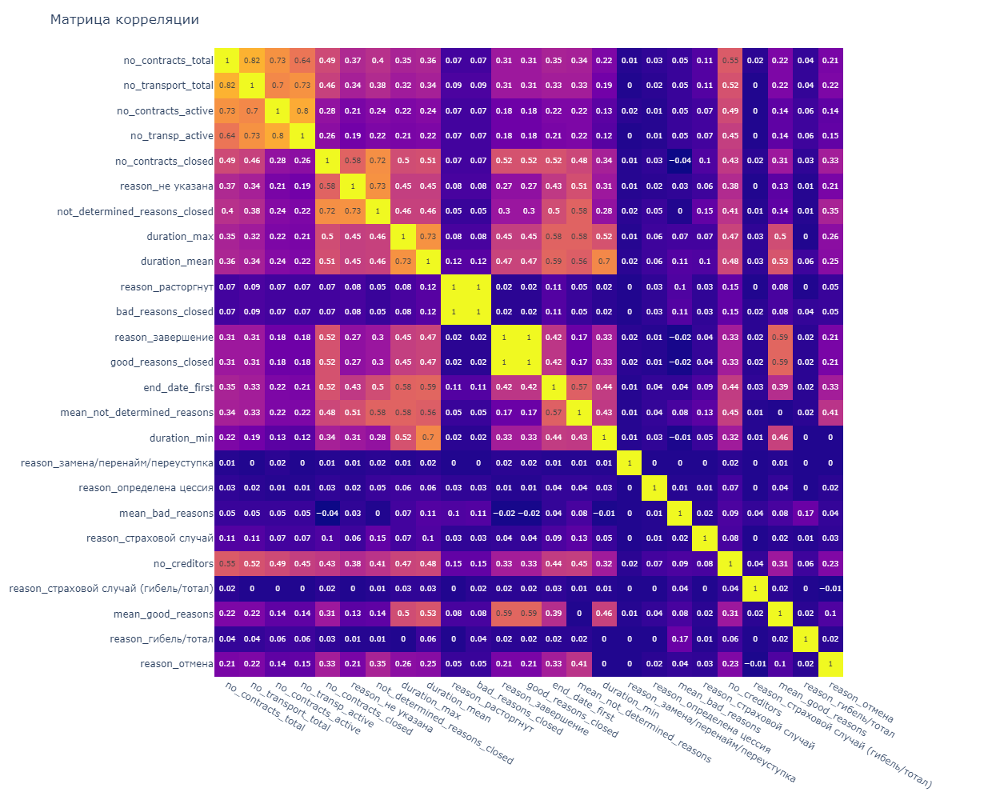

# ОТЧЕТ ПО АНАЛИЗУ ЛИНЕЙНОЙ ЗАВИСИМОСТИ ФИЧЕЙ

 
## Описание анализа

Целью данной работы является выявления линейной зависимости между фичами с помощью анализа корреляции и мультиколлиниарности. 
Корреляция позволяет определить степень линейной зависимости между двумя фичами. Коллиниарность - линейная зависимость между двумя фичами. Мультиколлиниарность - линейная зависимость между произвольным количеством фичей. 

Мульти-коллиниарность и корреляция не влияют на качество определения целевой переменной, но увеличивают дисперсию коэффициентов модели. Это приводит к невозможности с точностью интерпретировать влияние отдельной фичи на целевую переменную. 
Несмотря на то, что целью модели фед. ресурса является прогноз целевой переменной «Метки фрод (кред) дефолта», и задача интерпретации коэффициентов фичей для модели не ставилась, тем не менее, анализ линейной зависимости позволит исключить ряд фичей и, тем самым, сэкономить время и ресурсы на их расчет.

В качестве исходных данных использовались рассчитанные фичи target-class (файл data/interm/target_features.pkl), содержащие данные АО «Компания 1» c 01 января 2020 года для фрод дефолта.
 
## Анализ взаимной корреляции

Код анализа представлен в файле src/mdm/features/feature_correlation.ipynb.

Нестабильные или не репрезентативные фичи были исключены из анализа.

Поскольку корреляция очень чувствительна к выбросам (outliers), то перед анализом корреляции выбросы заменялись медианными значениями. Выбросами считались значения, выходящие за 95%-ный диапазон. Фичи: reason_замена/перенайм/переуступка', 'reason_определена цессия', 'reason_расторгнут', 'reason_страховой случай', 'reason_страховой случай (гибель/тотал)', 'reason_гибель/тотал', 'bad_ reasons_closed' не предобрабатывались, так как более 95% их значений равны нулю. 

Результирующие зависимости сохранены в файле «data/html_report/feature_correlation.html». 

На рисунке 1 показана матрица корреляции обучающей выборки без outliers. 

С помощью метода кластеризации AgglomerativeClustering выявлены пять групп с высокой взаимной корреляцией, представленные в таблице 1. Метрикой расстояния использовалась функция

$d_{i,j}=2 * (1 -|корреляция_{i,j} |)$

**Таблица 1. Группы с высокой взаимной корреляцией**

| номер|  	Группы с высокой степенью взаимной корреляции                                                                            |
| ----| ----------------------------------------------------------------------------------------------------------------------- |
| 1	| 'no_contracts_total',                                 'no_transport_total',   'no_contracts_active',            'no_transp_active' |
| 2	| 'no_contracts_closed',                               'reason_не указана',    'not_determined_reasons_closed',                     |
| 3	| 'duration_max',                                     'duration_mean',                                                            |
| 4	| 'reason_расторгнут',                                 'bad_reasons_closed'                                                       |
| 5	| 'reason_завершение',                                 'good_reasons_closed'                                                      |

На рисунках 2-6 представленные взаимные распределения групп фичей с высокой корреляцией.
 
  

_Рисунок 1. Матрица корреляции обучающей выборки без outliers_ 
 
  

_Рисунок 2. Группа 1 с высокой взаимной корреляцией_ 

  

_Рисунок 3.Группа 2 с высокой взаимной корреляцией_ 
 
  
 

_Рисунок 4. Группа 3 с высокой взаимной корреляцией_

  

_Рисунок 5. Группа 4 с высокой взаимной корреляцией_
 
   

_Рисунок 6. Группа 5 с высокой взаимной корреляцией_
 
### Описание взаимно-коррелированных групп

1. Фичи 'no_contracts_total', 'no_transport_total', 'no_contracts_active', 'no_transp_active' имеют высокую степень корреляции, поэтому

-	'no_contracts_total' - оставляется, поскольку эта фича имеет наибольший roc_auc, и его значение больше всего заполнено, так как меньшее количество договоров имеют активные или закрытые на момент принятия решения. 
-	'no_contracts_active' - исключается, так как мульти-коллинеарная с 'no_contracts_closed' и 'no_contracts_total' 
-	'no_transp_active' - оставлена, так как несмотря на корреляцию 0.63 с 'no_contracts_total', в данных видна гетероскедастичность (heteroscedasticity). 
-	'no_transport_total' - исключается, так как есть высокая степень корреляции с уже оставленными 'no_contracts_total' 0.82 и 'no_transp_active' 0.73 с визуальной линейной степенью зависимости. 

2. Фичи 'no_contracts_closed', 'reason_не указана', 'not_determined_reasons_closed' имеют высокую степень корреляции, поэтому
-	'no_contracts_closed' - оставляется, поскольку эта фича имеет наибольший roc_auc
-	'not_determined_reasons_closed' - оставляется, поскольку из-за гетероскедастичности (heteroscedasticity) нет явной линейной зависимости с 'no_contracts_closed', и фича имеет самый большой recall 0.96 в этой группе
-	'reason_не указана' - исключается, так как имеет явную линейную зависимость с 'not_determined_reasons_closed' 

3. Фичи средняя и максимальная длительность закрытых договоров ('duration_max' и 'duration_mean') не имеют явной линейной зависимости, несмотря на высокую степень корреляции 0.73. Поэтому обе фичи оставляются для дальнейшего анализа 
   
4. Фичи 'reason_расторгнут', 'bad_reasons_closed' имеют высокую степень корреляции и сильную линейную зависимости. Характеристики практически одинаковые по однофакторному анализу, но bad_reasons_closed включает в себя больше случав плохого завершения (не только расторжение, но и гибель/тотал), поэтому 
-	'reason_расторгнут' - исключается
-	'bad_reasons_closed' - оставляется

5. Фичи 'reason_завершение', 'good_reasons_closed' идентичны, что видно на pair plot и корреляции равной единице, поэтому
-	'reason_завершение' - исключается
-	'good_reasons_closed' – оставляется

Итого исключены по анализу корреляции фичи, представленные в таблице 2. Остальные фичи, не перечисленные в таблице 1, оставлены, так как не имеют сильной взаимной корреляции.

**Таблица 2. Исключенные фичи по анализу взаимной корреляции**

| feature             | Наименование                                                                  |
| ------------------- | ----------------------------------------------------------------------------- |
| no_contracts_active | Количество активных (действующих) договоров                                   |
| no_transp_active    | Количество активных (действующих) договоров только с транспортными средствами |
| reason_завершение   | Количество закрытых договоров по причине завершения договора                  |
| reason_не указана   | Количество закрытых договоров по неуказанной причине                          |
| reason_расторгнут   | Количество закрытых договоров по причине расторжения                          |

 
## Анализ мульти-коллиниарности

Код анализа представлен в файле src/mdm/features/feature_multicollinear.ipynb.

Рассчитанные фичи, согласно алгоритмам их формирования, содержат 5 групп линейно-зависимых групп, представленных в таблице 3. По одной фиче из каждой группы необходимо удалить.

**Таблица 3.Линейно-зависимые группы согласно расчету**

| Линейно-зависимые группы                                                                                                                                                    |
| --------------------------------------------------------------------------------------------------------------------------------------------------------------------------- |
| 'bad_reasons_closed' = 'reason_гибель/тотал' +  'reason_расторгнут' +  'reason_страховой случай (гибель/тотал)'                                                             |
| 'good_reasons_closed' = 'reason_завершение'                                                                                                                                 |
| 'not_determined_reasons_closed' = 'reason_замена/перенайм/переуступка' +  'reason_не указана' +  'reason_определена цессия' +  'reason_отмена' +  'reason_страховой случай' |
| 'no_contracts_closed' = 'not_determined_reasons_closed' +  'bad_reasons_closed' +  'good_reasons_closed'                                                                    |
| 'no_contracts_total' = 'no_contracts_active' +  'no_contracts_closed'                                                                                                       |

В таблице 4 представлен список фичей, исключенных ранее из-за нестабильности, не репрезентативности или коррелированности. Фича 'not_determined_reasons_closed' исключается, поскольку входит в список линейно-зависимых согласно таблице 3.

**Таблица 4. Исключенные ранее фичи**

| Исключенные фичи                                                                                         | Причины исключения                        |
| -------------------------------------------------------------------------------------------------------- | ----------------------------------------- |
| 'contract_date_delta_first', 'contract_date_delta_last','end_date_last'                                  | Нестабильные или не репрезентативные фичи |
| 'no_contracts_active', 'no_transp_active', 'reason_завершение', 'reason_не указана', 'reason_расторгнут' | Высокая корреляция с другими фичами       |
| 'not_determined_reasons_closed'                                                                          | Входит в группу линейно-зависимых фичей   |

 
Для оценки мульти-коллинеарности оставшегося перечня фичей использовался количественный показатель VIF (Variable Inflation Factors). Для вычисления значения VIF необходимо построить линейную регрессионную модель, где в качестве зависимой переменной будет использоваться рассматриваемый фактор, а в качестве независимых переменных будут выступать оставшиеся характеристики, входящие в модель. Итоговое значение VIF для рассматриваемой переменной может быть вычислено по формуле:

$VIF=  \frac{1}{1-R^2 }$

, где $R^2$ - коэффициент детерминации полученной модели — метрика, показывающая долю дисперсии переменной отклика регрессионной модели, которая может быть объяснена предикторными переменными. $R^2$ находится в диапазоне от 0 до 1. Чем выше значение $R^2$, тем лучше модель соответствует набору данных.

Диапазон значений $VIF$ от $1$ и до $+\infty$. Интерпретация полученных значений $VIF$ проводилась согласно таблице 5. Пороговое значение параметра $VIF$, при котором переменные считались мульти-коллинеарными другим факторам, было принято равным 2. Переменные, по которым значение $VIF$ превышало выбранный порог, исключались.

**Таблица 5. Интерпретация VIF**

| VIF | Интерпретация результата                                                            |
| --- | ----------------------------------------------------------------------------------- |
| 1   | Линейная зависимость между независимой переменной и другими переменными отсутствует |
| 1-2 | Отсутствие сильной линейной зависимости                                             |
| >2  | Присутствует сильная линейная зависимость                                           |

Регрессионная модель для вычисления значения VIF строилась на данных без выбросов. Выбросы заменялись на медианные значения согласно алгоритму описанному выше. 
 
В таблице 6 показаны полученные значения VIF для всех фичей, кроме ранее исключенных. Видно, что ряд фичей превышают пороговое значение $VIF>2$.

**Таблица 6. VIF фичей обучающих данных без выбросов**

| VIF      | Переменная                             |
| -------- | -------------------------------------- |
| 3.674984 | duration_mean                          |
| 3.469522 | no_contracts_total                     |
| 3.254041 | mean_not_determined_reasons            |
| 3.223764 | no_transport_total                     |
| 2.771284 | duration_max                           |
| 2.704222 | mean_good_reasons                      |
| 2.381525 | duration_min                           |
| 2.065637 | end_date_first                         |
| 2.060015 | no_contracts_closed                    |
| 1.955239 | good_reasons_closed                    |
| 1.833556 | no_creditors                           |
| 1.413493 | reason_отмена                          |
| 1.106413 | mean_bad_reasons                       |
| 1.054884 | bad_reasons_closed                     |
| 1.040335 | reason_гибель/тотал                    |
| 1.029729 | reason_страховой случай                |
| 1.007899 | reason_определена цессия               |
| 1.006009 | reason_страховой случай (гибель/тотал) |
| 1.001011 | reason_замена/перенайм/переуступка     |

В таблице 7 показаны полученные значения VIF при исключении фичей 'duration_mean', 'no_transport_total', 'mean_not_determined_reasons', 'end_date_first'.

**Таблица 7.Фичи, при критерии мульти-коллинеарности VIF>2**

| VIF      | Переменная                             |
| -------- | -------------------------------------- |
| 1.968960 | duration_max                           |
| 1.930499 | no_contracts_closed                    |
| 1.926102 | good_reasons_closed                    |
| 1.878113 | mean_good_reasons                      |
| 1.723763 | no_creditors                           |
| 1.635554 | no_contracts_total                     |
| 1.571514 | duration_min                           |
| 1.195993 | reason_отмена                          |
| 1.078484 | mean_bad_reasons                       |
| 1.041635 | bad_reasons_closed                     |
| 1.035443 | reason_гибель/тотал                    |
| 1.017040 | reason_страховой случай                |
| 1.007097 | reason_определена цессия               |
| 1.004203 | reason_страховой случай (гибель/тотал) |
| 1.000546 | reason_замена/перенайм/переуступка     |

 
Таким образом, общий перечень исключенных фичей представлен в таблице 8.

**Таблица 8. Перечень исключенных фичей после анализа на линейную зависимость**

| Исключенные фичи                                                                                         | Причины исключения                        |
| -------------------------------------------------------------------------------------------------------- | ----------------------------------------- |
| 'contract_date_delta_first', 'contract_date_delta_last','end_date_last'                                  | Нестабильные или не репрезентативные фичи |
| 'no_contracts_active', 'no_transp_active', 'reason_завершение', 'reason_не указана', 'reason_расторгнут' | Высокая корреляция с другими фичами       |
| 'not_determined_reasons_closed'                                                                          | Входит в группу линейно-зависимых фичей   |
| 'duration_mean', 'no_transport_total', 'mean_not_determined_reasons', 'end_date_first'                   | Мульти-коллинеарные, VIF>2                |

