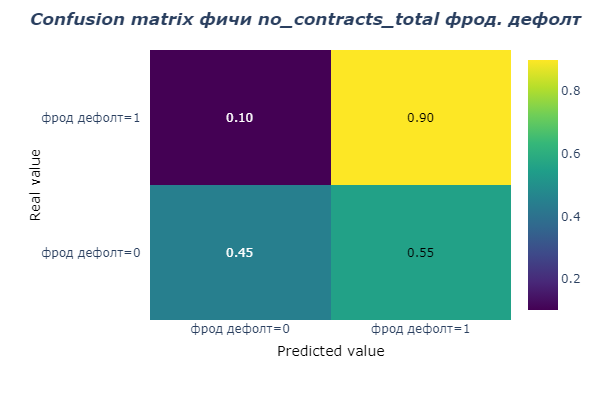

 
# ОТЧЕТ ПО МЕТРИКАМ ПРЕДСКАЗАТЕЛЬНОЙ СПОСОБНОСТИ ФИЧЕЙ

 
## ОПИСАНИЕ АНАЛИЗА

Однофакторный анализ обучающей выборки проводился с помощью логистической регрессии отдельно для кред и фрод моделей.

Код анализа представлен в файле src/mdm/features/feature_one_factor_analysis.ipynb.

В качестве исходных данных использовались рассчитанные фичи target-class (файл data/interm/target_features.pkl), содержащие данные АО «Компания 1» c 01 января 2020 года для фрод дефолта.

Нестабильные или не репрезентативные фичи были исключены из анализа.

На рисунках 1- 2 показаны метрики качества rocauc, accuracy, recall для фрод и кред моделей соответственно. 

Значения метрик для фрод и кред моделей приводятся в таблице 1-2 соответственно. 

Результат сохранен в файле «data/html_report/metrics_one_factor.html». 

confusion matrix для фрод и кред дефолтов по каждой фиче сохраняются в файле «data/html_report/confusion_matrixes_frod.html» и «data/html_report/confusion_matrixes_cred.html» соответственно.

## РЕЗУЛЬТАТЫ АНАЛИЗА

Самыми лучшими для фрод модели с точки зрения:

•	rocauc являются: 'no_contracts_total', 'no_contracts_closed', 'duration_max', 'end_date_first' 

•	accuracy - 'no_contracts_total', 'no_contracts_closed', 'no_transport_total' 

•	recall  у многих 1, но это у тех, у кого распределение практически все значения 0. И recall у них =1 за счет низкого accuracy.

Самыми лучшими для кред модели с точки зрения:

•	rocauc являются: 'end_date_first', 'duration_mean', 'duration_max', 'mean_not_determined_reasons'

•	accuracy - 'reason_гибель/тотал', 'reason_определена цессия', 'reason_страховой случай (гибель/тотал)', 'reason_расторгнут', 'mean_bad_reasons', 'bad_reasons_closed'

•	recall  'reason_замена/перенайм/переуступка', 'reason_страховой случай', 'reason_отмена'.
 
  

_Рисунок 1. Метрики качества в модели фрод дефолта_

  

_Рисунок 2. Метрики качества в модели кред дефолта_

  

_Рисунок 3. Confusion matrix фичи количество договоров в модели фрод дефолта_

**Таблица 1. Метрики фичей фрод модели**

| feature                                | rocauc | accuracy | recall | intercept | coef      |
| -------------------------------------- | ------ | -------- | ------ | --------- | --------- |
| no_contracts_total                     | 0,67   | 0,48     | 0,9    | -0,432    | [-2.1541] |
| no_transport_total                     | 0,65   | 0,43     | 0,92   | -0,4334   | [-2.214]  |
| no_contracts_active                    | 0,63   | 0,38     | 0,92   | -0,2332   | [-1.4218] |
| no_transp_active                       | 0,64   | 0,43     | 0,89   | -0,2558   | [-1.5561] |
| no_contracts_closed                    | 0,67   | 0,44     | 0,93   | -0,6405   | [-3.067]  |
| reason_гибель/тотал                    | 0,5    | 0,07     | 1      | -0,0004   | [-0.0328] |
| reason_завершение                      | 0,61   | 0,29     | 0,97   | -0,4312   | [-2.6368] |
| reason_замена/перенайм/переуступка     | 0,5    | 0,07     | 1      | -0,0021   | [-0.194]  |
| reason_не указана                      | 0,61   | 0,31     | 0,97   | -0,4349   | [-2.5539] |
| reason_определена цессия               | 0,5    | 0,08     | 1      | -0,0036   | [-0.207]  |
| reason_отмена                          | 0,56   | 0,2      | 0,97   | -0,2269   | [-1.5821] |
| reason_расторгнут                      | 0,52   | 0,11     | 0,99   | -0,0107   | [-0.2095] |
| reason_страховой случай                | 0,51   | 0,08     | 1      | -0,0367   | [-0.5739] |
| reason_страховой случай (гибель/тотал) | 0,5    | 0,07     | 1      | -0,0018   | [-0.1305] |
| bad_reasons_closed                     | 0,52   | 0,11     | 0,99   | -0,0111   | [-0.2139] |
| good_reasons_closed                    | 0,61   | 0,29     | 0,97   | -0,4312   | [-2.6368] |
| not_determined_reasons_closed          | 0,64   | 0,36     | 0,96   | -0,5466   | [-2.8688] |
| mean_bad_reasons                       | 0,52   | 0,11     | 0,99   | -0,0027   | [-0.0796] |
| mean_good_reasons                      | 0,61   | 0,29     | 0,97   | -0,1915   | [-0.8073] |
| mean_not_determined_reasons            | 0,64   | 0,36     | 0,96   | -0,3283   | [-1.0464] |
| no_creditors                           | 0,64   | 0,4      | 0,91   | -0,1269   | [-0.6622] |
| duration_max                           | 0,66   | 0,41     | 0,94   | -0,4201   | [-1.2145] |
| duration_mean                          | 0,65   | 0,41     | 0,94   | -0,4049   | [-1.1961] |
| duration_min                           | 0,62   | 0,33     | 0,95   | -0,2785   | [-1.0148] |
| end_date_first                         | 0,66   | 0,41     | 0,95   | -0,5401   | [-1.5437] |

**Таблица 2. Метрики фичей кредитной модели**

| feature                                | rocauc | accuracy | recall | intercept | coef      |
| -------------------------------------- | ------ | -------- | ------ | --------- | --------- |
| no_contracts_total                     | 0,53   | 0,28     | 0,81   | -0,0143   | [-0.2114] |
| no_transport_total                     | 0,53   | 0,27     | 0,81   | -0,008    | [-0.1517] |
| no_contracts_active                    | 0,51   | 0,26     | 0,79   | -0,0033   | [-0.0962] |
| no_transp_active                       | 0,51   | 0,28     | 0,77   | -0,0015   | [-0.0619] |
| no_contracts_closed                    | 0,57   | 0,31     | 0,87   | -0,0473   | [-0.4225] |
| reason_гибель/тотал                    | 0,5    | 0,95     | 0      | -0,0001   | [0.0124]  |
| reason_завершение                      | 0,55   | 0,26     | 0,88   | -0,0307   | [-0.3446] |
| reason_замена/перенайм/переуступка     | 0,5    | 0,05     | 1      | -0,0021   | [-0.2004] |
| reason_не указана                      | 0,58   | 0,3      | 0,9    | -0,0547   | [-0.4939] |
| reason_определена цессия               | 0,5    | 0,95     | 0      | -0,0001   | [0.0249]  |
| reason_отмена                          | 0,54   | 0,2      | 0,91   | -0,0204   | [-0.287]  |
| reason_расторгнут                      | 0,5    | 0,91     | 0,04   | -0,0013   | [0.0634]  |
| reason_страховой случай                | 0,5    | 0,06     | 0,99   | -0,0039   | [-0.1134] |
| reason_страховой случай (гибель/тотал) | 0,5    | 0,95     | 0      | -0,0002   | [0.0152]  |
| bad_reasons_closed                     | 0,5    | 0,91     | 0,04   | -0,0014   | [0.0648]  |
| good_reasons_closed                    | 0,55   | 0,26     | 0,88   | -0,0307   | [-0.3446] |
| not_determined_reasons_closed          | 0,59   | 0,36     | 0,85   | -0,0571   | [-0.4924] |
| mean_bad_reasons                       | 0,5    | 0,91     | 0,04   | -0,0036   | [0.0811]  |
| mean_good_reasons                      | 0,55   | 0,26     | 0,89   | -0,0334   | [-0.2857] |
| mean_not_determined_reasons            | 0,59   | 0,35     | 0,85   | -0,0843   | [-0.458]  |
| no_creditors                           | 0,55   | 0,38     | 0,75   | -0,0079   | [-0.1346] |
| duration_max                           | 0,59   | 0,39     | 0,82   | -0,0578   | [-0.3652] |
| duration_mean                          | 0,59   | 0,39     | 0,82   | -0,0588   | [-0.3691] |
| duration_min                           | 0,56   | 0,29     | 0,87   | -0,0403   | [-0.3101] |
| end_date_first                         | 0,59   | 0,37     | 0,84   | -0,0624   | [-0.3828] |

