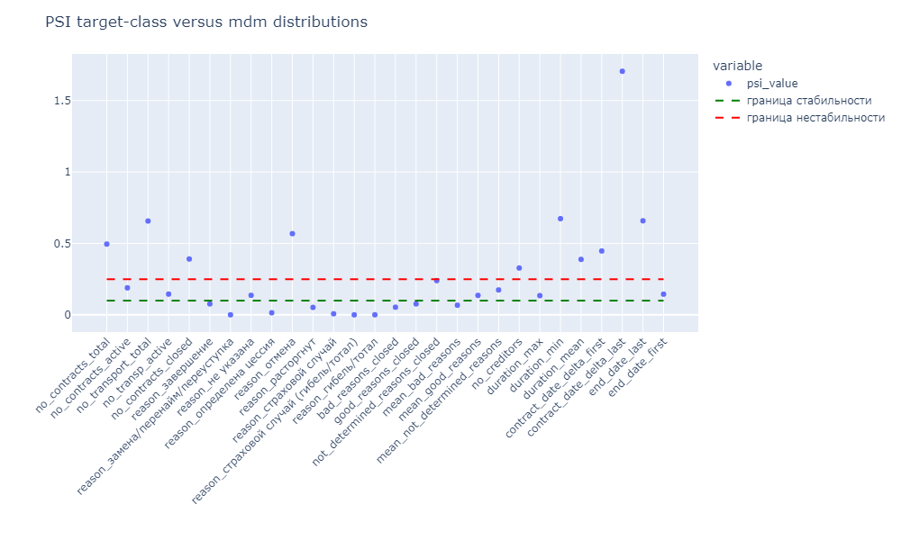

 
# ОТЧЕТ ПО АНАЛИЗУ РЕПРЕЗЕНТАТИВНОСТИ ТЕСТОВОЙ ВЫБОРКИ МОДЕЛИ ПО ДАННЫМ ФЕДЕРАЛЬНОГО РЕСУРСА   

 
## ПОСТАНОВКА ЗАДАЧИ  

Несмотря на то, что алгоритмы расчета фичей для обучающей выборки target-class и для данных фед. ресурса MDM похожие, однако, имеют принципиальные различия. Фичи для обучающей выборки target-class считаются в разрезе сделки, а, значит, один и тот же лизингополучатель (ИНН) может учитываться несколько раз (по количеству сделок). Таким образом, выборка target-class является зависимой: если ли у лизингополучателя (ИНН) в рамках какой-либо сделки нет признака фрод дефолта, то, наиболее вероятно, не будет этого признака у этого же лизингополучателя в другой сделке. Выборка фичей фед. ресурса MDM в этом смысле является более независимой, так как считается в разрезе лизингополучателей (ИНН).   

Другим принципиальным отличием является состав предметов лизинга в договорах. В обучающей выборке target-class содержатся только сделки по транспортным средствам Компании 1, в то время как в фед. ресурсе MDM представлены договоры лизинга по всем типам предметов лизинга (суда, самолеты, материальные запасы и др.), имеющими большой разброс цены и количества предметов в одном договоре.   

Учитывая выше, необходимо провести анализ репрезентативности обучающей выборки и оценить, насколько велики отличия выборок.   

Анализ репрезентативности обучающей выборки проведен в файле src/mdm/features/feature_representativeness.ipynb.  

В качестве исходных данных использовались:
-	рассчитанные фичи по данным Федерального ресурса (файл data/interm/features_mdm.pkl)
-	рассчитанные фичи target-class (файл data/interm/target_features.pkl), содержащие данные АО «Компания 1» c 01 января 2020 года для фрод дефолта.

Для определения репрезентативности тестовой выборки для оценки фичей анализировались распределения по каждой фиче, q-q plot, эмпирические кумулятивные функции распределения (empirical cumulative distribution function), а также расчет PSI (индекс стабильности популяции).
 
## Q-Q PLOTS, ЭМПИРИЧЕСКОЙ КУМУЛЯТИВНОЙ ФУНКЦИЙ РАСПРЕДЕЛЕНИЯ 

На рисунке 1 показан пример q-q plot  и распределений тестовой выборки и MDM для фичи «Количество договоров (всех закрытых и действующих)». На рисунке 2 показана эмпирическая кумулятивная функция распределения по той же фиче «Количество договоров (всех закрытых и действующих)».  

В таблице 1 приводится результат анализа по каждой фиче.

 
**Рисунок 1. q-q plot фичи «Количество договоров (всех закрытых и действующих)»**

 
 
**Рисунок 2. empirical cumulative distribution function фичи «Количество договоров (всех закрытых и действующих)»**

 

**Таблица 1. результат сравнительного анализа тестовой и mdm выборкам по каждой фиче**
|    | feature                                | Наименование                                                                         | Описание                                                                                                                                                                                                                                                                                                                                                                                                                                                                                                                                                                                                                                                                                                                                                       | Резолюция                                                                                                                                                                                                                                                                                   |
|---:|:---------------------------------------|:-------------------------------------------------------------------------------------|:---------------------------------------------------------------------------------------------------------------------------------------------------------------------------------------------------------------------------------------------------------------------------------------------------------------------------------------------------------------------------------------------------------------------------------------------------------------------------------------------------------------------------------------------------------------------------------------------------------------------------------------------------------------------------------------------------------------------------------------------------------------|:--------------------------------------------------------------------------------------------------------------------------------------------------------------------------------------------------------------------------------------------------------------------------------------------|
|  0 | no_contracts_total                     | Количество договоров (всех закрытых и действующих)                                   | 80% всех сделок в обучающей выборке target-class имеют значения фичи от 0 до 8, в mdm 80% всех лизингополучателей имеют значения фичи от 0 до 5, то есть отличаются не более чем на 3 договора. В mdm распределение более резко падает с ростом количества договоров, чем в тестовой выборке. В тестовой выборке распределение более растянуто по оси значения фичи. Дефолтные сделки находятся в основном с малым значением договоров, поэтому данная фича может быть использована в модели, так как она будет более консервативной, чем в обучающей выборке (если при обучении выбран порог, например, 5 договоров, то 5 договоров в базе mdm отсеивает еще большую долю договоров среди общего количества)                                                  | фича репрезентативна, характер распределения сохранен, в модели значение будет более консервативно, чем в обучающей выборке target-class                                                                                                                                                    |
|  1 | no_contracts_active                    | Количество активных (действующих) договоров                                          | Имеют схожий характер no_contracts_total, но в mdm большее относительное количество лизингополучателей имеют один активный договор, распределение в mdm более резко снижается с ростом активных договоров. 80% всех сделок в обучающей выборке target-class имеют значения фичи от 0 до 5, в mdm 80% всех лизингополучателей имеют значения фичи от 0 до 3. Учитывая, что дефолтные сделки сосредоточены в области малого количества активных договоров, то данная фича может использоваться в модели и нет необходимости в более консервативном сдвиге по сравнении с обучающей выборке                                                                                                                                                                       | фича репрезентативна, характер распределения сохранен, в модели значение будет более консервативно, чем в обучающей выборке target-class                                                                                                                                                    |
|  2 | no_transport_total                     | Количество договоров только с транспортными средствами (всех закрытых и действующих) | Аналогично фиче no_contracts_total. 80% всех сделок в обучающей выборке target-class имеют значения фичи от 0 до 6, в mdm 80% всех лизингополучателей имеют значения фичи от 0 до 4, то есть отличаются не более чем на 2 договора. В mdm распределение более резко падает с ростом количества договоров, чем в тестовой выборке. Дефолтные сделки находятся в основном с малым значением договоров, поэтому данная фича может быть использована в модели, так как она будет более консервативной, чем в обучающей выборке                                                                                                                                                                                                                                     | фича репрезентативна, характер распределения сохранен, в модели значение будет более консервативно, чем в обучающей выборке target-class                                                                                                                                                    |
|  3 | no_transp_active                       | Количество активных (действующих) договоров только с транспортными средствами        | Имеют схожий характер c no_contracts_total, но в mdm большее количество ИНН имеют один активный договор, распределение в mdm более резко снижается с ростом активных договоров. 80% всех сделок в обучающей выборке target-class имеют значения фичи от 0 до 4, в mdm 80% всех договоров имеют значения фичи от 0 до 2. Учитывая, что дефолтные сделки сосредоточены в области малого количества активных договоров, то данная фича может использоваться в модели и нет необходимости в более консервативном сдвиге по сравнении с обучающей выборке                                                                                                                                                                                                           | фича репрезентативна, характер распределения сохранен, в модели значение будет более консервативно, чем в обучающей выборке target-class                                                                                                                                                    |
|  4 | no_contracts_closed                    | Количество закрытых договоров                                                        | Характер распределения отличается. В обучающей выборке 63 процентов сделок имеют 0 завершенных договоров на дату принятия решения, в то время как в базе mdm их всего 38% лизингополучателей. Однако потом распределение практически идентично. До 85% всех сделок в target-class и лизингополучателей в mdm имеют одинаковое значение закрытых договоров до 3х. до 95% процентов распределения различаются не более чем на 3 договора в сторону более консервативного значения в mdm.                                                                                                                                                                                                                                                                         | фича репрезентативна. До 85% всех сделок в target-class и лизингополучателей в mdm имеют одинаковое значение закрытых договоров до 3х.                                                                                                                                                      |
|  5 | reason_завершение                      | Количество закрытых договоров по причине завершения договора                         | Анализ проводился только по тем сделкам (лизингополучателям) у которых есть закрытые договоры, то есть no_contracts_closed>0. 85% всех сделок в обучающей выборке target-class имеют значения фичи от 0 до 3, в mdm 85% всех лизингополучателей имеют значения фичи от 0 до 2. Распределение практически идентично.                                                                                                                                                                                                                                                                                                                                                                                                                                            | фича репрезентативна, распределения практически идентичны (до 85%), значение фичи будет в модели более консервативно, чем в обучающей выборке                                                                                                                                               |
|  6 | reason_замена/перенайм/переуступка     | Количество закрытых договоров по причине замена/перенайм/переуступка                 | Анализ проводился только по тем сделкам (лизингополучателям) у которых есть закрытые договоры, то есть no_contracts_closed>0.  99.9% сделок в обучающей выборке target-class и 99.8% лизингополучателей имеют значения фичи 0.                                                                                                                                                                                                                                                                                                                                                                                                                                                                                                                                 | распределение одинаковое. 99.8% значений имеют нулевое значение, среди тех, у которых есть закрытые договоры.                                                                                                                                                                               |
|  7 | reason_не указана                      | Количество закрытых договоров по неуказанной причине                                 | Анализ проводился только по тем сделкам (лизингополучателям) у которых есть закрытые договоры, то есть no_contracts_closed>0. Характер распределения одинаковый. В mdm у большего соотношения лизингополучателей причина завершения не указана. Учитывая, что дефолтные сделки сосредоточены в области меньшего количества не указанных сделок, то данная фича может использоваться в модели и будет более консервативной. чем в обучающей выборке                                                                                                                                                                                                                                                                                                             | фича репрезентативна, характер распределения сохранен, в модели значение будет более консервативно, чем в обучающей выборке target-class                                                                                                                                                    |
|  8 | reason_определена цессия               | Количество закрытых договоров по причине цессии                                      | Анализ проводился только по тем сделкам (лизингополучателям) у которых есть закрытые договоры, то есть no_contracts_closed>0.  98% сделок в обучающей выборке target-class и 97% лизингополучателей имеют значения фичи 0. Фича более консервативна в обучающей выборке, чем в mdm                                                                                                                                                                                                                                                                                                                                                                                                                                                                             | фича репрезентативна, характер распределения сохранен, но в обучающей выборке значение фичи более консервативно, поэтому в модели применятся может только с учетом увеличения значения                                                                                                      |
|  9 | reason_отмена                          | Количество закрытых договоров по причине отмены                                      | Анализ проводился только по тем сделкам (лизингополучателям) у которых есть закрытые договоры, то есть no_contracts_closed>0. В обучающей выборке 36%  сделок имеют отмены в качестве завершенных договоров на дату принятия решения, в то время как в базе mdm таких  лишь 8% лизингополучателей. Учитывая, что дефолтные сделки сосредоточены в области меньшего количества отмененных сделок, то данная фича может использоваться в модели и будет более консервативной. чем в обучающей выборке                                                                                                                                                                                                                                                            | фича репрезентативна, характер распределения сохранен, в модели значение будет более консервативно, чем в обучающей выборке target-class                                                                                                                                                    |
| 10 | reason_расторгнут                      | Количество закрытых договоров по причине расторжения                                 | Анализ проводился только по тем сделкам (лизингополучателям) у которых есть закрытые договоры, то есть no_contracts_closed>0. 89% всех сделок в обучающей выборке target-class имеют значения фичи 0, в mdm 95% всех лизингополучателей имеют значения фичи от 0. Распределения практически идентичны. Данная фича может использоваться в модели и будет более консервативной, чем в обучающей выборке                                                                                                                                                                                                                                                                                                                                                         | фича репрезентативна, распределения практически идентичны (до 99%), значение фичи будет в модели чуть более консервативно, чем в обучающей выборке                                                                                                                                          |
| 11 | reason_страховой случай                | Количество закрытых договоров по причине страхового случая                           | Анализ проводился только по тем сделкам (лизингополучателям) у которых есть закрытые договоры, то есть no_contracts_closed>0. Распределения практически совпадают. 96% всех сделок в обучающей выборке target-class имеют значения фичи 0, в mdm 95% всех лизингополучателей имеют значения фичи от 0.                                                                                                                                                                                                                                                                                                                                                                                                                                                         | фича репрезентативна, распределения практически идентичны                                                                                                                                                                                                                                   |
| 12 | reason_страховой случай (гибель/тотал) | Количество закрытых договоров по причине страхового случая (гибель/тотал)            | Анализ проводился только по тем сделкам (лизингополучателям) у которых есть закрытые договоры, то есть no_contracts_closed>0.   Распределения совпадают. 99.9% сделок в обучающей выборке target-class и 99.9% лизингополучателей имеют значения фичи 0.                                                                                                                                                                                                                                                                                                                                                                                                                                                                                                       | 99.9% значений имеют нулевое значение, среди тех, у которых есть закрытые договоры.                                                                                                                                                                                                         |
| 13 | reason_гибель/тотал                    | Количество закрытых договоров по причине гибель/тотал                                | Анализ проводился только по тем сделкам (лизингополучателям) у которых есть закрытые договоры, то есть no_contracts_closed>0.  99.7% сделок в обучающей выборке target-class и 99.8% лизингополучателей имеют значения фичи 0.                                                                                                                                                                                                                                                                                                                                                                                                                                                                                                                                 | распределение одинаковое.  99.7% значений имеют нулевое значение, среди тех, у которых есть закрытые договоры.                                                                                                                                                                              |
| 14 | bad_reasons_closed                     | Количество договоров c признаками плохого завершения                                 | Анализ проводился только по тем сделкам (лизингополучателям) у которых есть закрытые договоры, то есть no_contracts_closed>0.    88% сделок в обучающей выборке target-class и 95% лизингополучателей имеют значения фичи 0.                                                                                                                                                                                                                                                                                                                                                                                                                                                                                                                                   | фича репрезентативна, характер распределения сохранен, но в обучающей выборке значение фичи более консервативно, поэтому в модели применятся может только с учетом увеличения значения                                                                                                      |
| 15 | good_reasons_closed                    | Количество договоров c признаками хорошего завершения                                | Анализ проводился только по тем сделкам (лизингополучателям) у которых есть закрытые договоры, то есть no_contracts_closed>0. 88% всех сделок в обучающей выборке target-class и имеют значения фичи от 0 до 4, в mdm 88% всех лизингополучателей имеют значения фичи от 0 до 3. Распределения имеют схожий характер, значения фичи будет в модели будет более консервативно                                                                                                                                                                                                                                                                                                                                                                                   | фича репрезентативна, распределения носят схожий характер, значение фичи будет в модели более консервативно, чем в обучающей выборке                                                                                                                                                        |
| 16 | not_determined_reasons_closed          | Количество договоров с неопределенным завершением                                    | Анализ проводился только по тем сделкам (лизингополучателям) у которых есть закрытые договоры, то есть no_contracts_closed>0. 77% всех сделок в обучающей выборке target-class и имеют значения фичи от 0 до 4, в mdm 77% всех лизингополучателей имеют значения фичи от 0 до 2. Распределение имеют схожий характер, значения фичи будет в модели будет более консервативно                                                                                                                                                                                                                                                                                                                                                                                   | фича репрезентативна, распределения носят схожий характер, значение фичи будет в модели более консервативно, чем в обучающей выборке                                                                                                                                                        |
| 17 | mean_bad_reasons                       | Среднее количество закрытых договоров с отрицательным исходом                        | Анализ проводился только по тем сделкам (лизингополучателям) у которых есть закрытые договоры, то есть no_contracts_closed>0. Характер распределения различен. В mdm более равномерно распределены значения по значениям от 0 до 1, в обучающей выборке имеют больше значений от 0 до 0.5 среднего плохого окончания                                                                                                                                                                                                                                                                                                                                                                                                                                           | фича не репрезентативна, имеет различный характер распределения                                                                                                                                                                                                                             |
| 18 | mean_good_reasons                      | Среднее количество закрытых договоров с положительным исходом                        | Анализ проводился только по тем сделкам (лизингополучателям) у которых есть закрытые договоры, то есть no_contracts_closed>0. Характер распределения различен. Значения в mdm больше сдвинуты в сторону большего значения mean_good_reasons: 69% лизингодателей имеют значения среднего количества с положительным исходом от 0 до 0.98,   69% сделок в target-class имеют значения  от 0 до 0.5.                                                                                                                                                                                                                                                                                                                                                              | фича не репрезентативна, имеет различный характер распределения                                                                                                                                                                                                                             |
| 19 | mean_not_determined_reasons            | Среднее количество закрытых договоров с неопределенным исходом                       | Анализ проводился только по тем сделкам (лизингополучателям) у которых есть закрытые договоры, то есть no_contracts_closed>0. Фича не репрезентативна.                                                                                                                                                                                                                                                                                                                                                                                                                                                                                                                                                                                                         | фича не репрезентативна, имеет различный характер распределения                                                                                                                                                                                                                             |
| 20 | no_creditors                           | Количество различных лизингодателей                                                  | 90% всех сделок в обучающей выборке target-class имеют значения фичи от 0 до 3, в mdm 90% всех лизингополучателей имеют значения фичи от 1 до 3. Распределения практически идентичны.                                                                                                                                                                                                                                                                                                                                                                                                                                                                                                                                                                          | фича репрезентативна, распределения практически идентичны (до 90%), значение фичи будет в модели более консервативно, чем в обучающей выборке                                                                                                                                               |
| 21 | duration_max                           | Максимальная длительность закрытых договоров                                         | Анализ проводился только по тем сделкам (лизингополучателям) у которых есть закрытые договоры, то есть no_contracts_closed>0. Характер распределения схож. Однако в target-class явно выражен всплеск около 70 дней максимальной длительность договоров, имеющих большую долю дефолта, в mdm такой всплеск есть, но почти незаметный. Остальные всплески в mdm носят тот же характер (чаще всего около 1 года, 2 лет и т.д.), но в target-class более равномерно распределены сделки по годам, а в mdm большая доля лизингодателей имеет максимальную длительности 3 года. Можно ли будет использовать эту фичу, будет зависеть от модели и границы принятия решения. Возможно, она будет более консервативна, а может быть, наоборот потребуется ее коррекция | Характер схож, но всплески распределения в target-class более равномерно кратно целым годам, чем в mdm. Можно ли будет использовать эту фичу, будет зависеть от модели и границы принятия решения. Возможно, она будет более консервативна, а может быть, наоборот потребуется ее коррекция |
| 22 | duration_min                           | Минимальная длительность закрытых договоров                                          | Анализ проводился только по тем сделкам (лизингополучателям) у которых есть закрытые договоры, то есть no_contracts_closed>0.                                                                                                                                                                                                                                                                                                                                                                                                                                                                                                                                                                                                                                  | Характер схож, но всплески распределения в mdm более равномерно кратно целым годам, чем в target-class. Можно ли будет использовать эту фичу, будет зависеть от модели и границы принятия решения. Возможно, она будет более консервативна, а может быть, наоборот потребуется ее коррекция |
|    |                                        |                                                                                      | Характер распределения схож. Однако в target-class явно выражен всплеск около 70 дней минимальной длительности договоров, имеющих большую долю дефолта, в mdm такой всплеск есть, но почти незаметный. Остальные всплески в mdm носят тот же характер (чаще всего около 1 года, 2 лет и т.д.), но в mdm более равномерно, а в target-class, большая доля на средней длительности в 1 год, во 2 год и последующие меньше доля сделок. Можно ли будет использовать эту фичу, будет зависеть от модели и границы принятия решения. Возможно, она будет более консервативна, а может быть, наоборот потребуется ее коррекция                                                                                                                                       |                                                                                                                                                                                                                                                                                             |
| 23 | duration_mean                          | Средняя длительность закрытых договоров                                              | Анализ проводился только по тем сделкам (лизингополучателям) у которых есть закрытые договоры, то есть no_contracts_closed>0. Характер распределения схож. Однако в target-class явно выражен всплеск около 70 дней максимальной длительность договоров, имеющих большую долю дефолта, в mdm такой всплеск есть, но почти незаметный. Остальные всплески в mdm носят тот же характер (чаще всего около 1 года, 2 лет и т.д.), но в mdm более равномерно, а в target-class, большая доля на средней длительности в 1 год, во 2 год и последующие меньше доля сделок. Можно ли будет использовать эту фичу, будет зависеть от модели и границы принятия решения. Возможно, она будет более консервативна, а может быть, наоборот потребуется ее коррекция        | Характер схож, но всплески распределения в mdm более равномерно кратно целым годам, чем в target-class. Можно ли будет использовать эту фичу, будет зависеть от модели и границы принятия решения. Возможно, она будет более консервативна, а может быть, наоборот потребуется ее коррекция |
| 24 | contract_date_delta_first              | Разница до даты заключения первого договора                                          | Анализ проводился только по тем сделкам (лизингополучателям) у которых разница до даты заключения первого договора существует, то есть contract_date_delta_first>0                                                                                                                                                                                                                                                                                                                                                                                                                                                                                                                                                                                             | Фичу нельзя использовать. Тестовая выборка для фичи не репрезентативна                                                                                                                                                                                                                      |
|    |                                        |                                                                                      |  Характер распределения различен, особенно в зоне, где доля дефолтов большая ( при малых значениях фичи). Выборка не репрезентативна                                                                                                                                                                                                                                                                                                                                                                                                                                                                                                                                                                                                                           |                                                                                                                                                                                                                                                                                             |
| 25 | contract_date_delta_last               | Разница до даты заключения последнего договора                                       | Анализ проводился только по тем сделкам (лизингополучателям) у которых разница до даты заключения первого договора существует, то есть contract_date_delta_last>0                                                                                                                                                                                                                                                                                                                                                                                                                                                                                                                                                                                              | Фичу нельзя использовать. Тестовая выборка для фичи не репрезентативна                                                                                                                                                                                                                      |
|    |                                        |                                                                                      |  Характер распределения различен, особенно в зоне, где доля дефолтов большая ( при малых значениях фичи). Выборка не репрезентативна                                                                                                                                                                                                                                                                                                                                                                                                                                                                                                                                                                                                                           |                                                                                                                                                                                                                                                                                             |
| 26 | end_date_last                          | Разница до даты самого последнего завершения договора                                | Анализ проводился только по тем сделкам (лизингополучателям) у которых есть закрытые договоры, то есть no_contracts_closed>0. Характер распределения различен, особенно в зоне, где доля дефолтов большая ( при малых значениях фичи). Выборка не репрезентативна                                                                                                                                                                                                                                                                                                                                                                                                                                                                                              | Фичу нельзя использовать. Тестовая выборка для фичи не репрезентативна                                                                                                                                                                                                                      |
| 27 | end_date_first                         | Разница до даты самого первого завершения договора                                   | Анализ проводился только по тем сделкам (лизингополучателям) у которых есть закрытые договоры, то есть no_contracts_closed>0. Характер распределения различен, особенно в зоне, где доля дефолтов большая ( при малых значениях фичи). Выборка не репрезентативна                                                                                                                                                                                                                                                                                                                                                                                                                                                                                              | Фичу нельзя использовать. Тестовая выборка для фичи не репрезентативна                                                                                                                                                                                                                      |

## Итог по q-q plot:  

Фичи mean_bad_reasons, mean_good_reasons , mean_not_determined_reasons, contract_date_delta_first , contract_date_delta_last, end_date_first , end_date_last **не репрезентативны** и в модели **не должны использоваться**.

Фичи no_contracts_total, no_contracts_active, no_transport_total, no_transp_active, reason_завершение, reason_не указана, reason_отмена, reason_расторгнут, not_determined_reasons_closed, no_creditors в модели будут более консервативны, чем в обучающей выборке. 

## Расчет PSI (индекс стабильности популяции)

Индекс PSI может использоваться для изучения сходства/различия между выборками. Общая формула для расчета PSI:

$PSI=\sum_{bin=1}^{n\_bins} {(\%Actual-\%Expected) * ln(\frac{\%Actual}{\%Expected})}$ ,  
где в нашем случае Actual – обучающая выборка target-class, Expected – выборка MDM.

PSI определяет степень различий в распределениях:
- <0.1 – незначительные изменения
- 0.1-0.2 – некоторые несущественные изменения
- 0.25 – значительные изменения

Предварительно значения фичей разбиваются на бины (bin) и рассчитываются проценты содержания значений в каждой группе (bin) - %Actual, %Expected. Границы каждой группы, а также проценты в выборке MDM в каждой группы приводятся в таблице 2. При разбиении была попытка уравнять в каждом бине процентное соотношение значений, где это возможно. 

**Таблица 2. Используемые bins**

|    | feature                                |   n_bins | bins                                                                                                                            | Проценты в бине                                                                                       |
|---:|:---------------------------------------|---------:|:--------------------------------------------------------------------------------------------------------------------------------|:------------------------------------------------------------------------------------------------------|
|  0 | no_contracts_total                     |        9 | [   1    2    3    4    5    6    9   16 7192]                                                                                  | [45.6  18.1   9.43  5.75  4.01  6.49  5.59  5.03]                                                     |
|  1 | no_contracts_active                    |        7 | [   0    1    2    3    5    9 1775]                                                                                            | [36.51 31.91 11.64  8.97  5.72  5.24]                                                                 |
|  2 | no_transport_total                     |        9 | [   0    1    2    3    4    5    7   12 7111]                                                                                  | [13.16 41.73 16.17  8.03  4.86  5.56  5.3   5.18]                                                     |
|  3 | no_transp_active                       |        8 | [   0    1    2    3    4    5    9 1745]                                                                                       | [48.47 27.45  9.54  4.29  2.53  4.18  3.54]                                                           |
|  4 | no_contracts_closed                    |        7 | [   0    1    2    3    5    8 5417]                                                                                            | [38.   32.01 11.32  8.58  4.69  5.41]                                                                 |
|  5 | reason_завершение                      |        6 | [   0    1    2    3    4    6 1391]                                                                                            | [46.63 31.38  9.73  4.29  3.77  4.2 ]                                                                 |
|  6 | reason_замена/перенайм/переуступка     |        6 | [ 0  1  2  3  4  5  9 29]                                                                                                       | [99.89, 0.07, 0.02, 0.01, 0.0, 0.01, 0.01]                                                            |
|  7 | reason_не указана                      |        5 | [   0    1    2    4    6 4796]                                                                                                 | [40.49 34.41 15.    4.27  5.83]                                                                       |
|  8 | reason_определена цессия               |       12 | [  0   1   2   3   4   5   6   7   8   9  11  14  22 122]                                                                       | [96.66, 2.22, 0.52, 0.2, 0.13, 0.07, 0.05, 0.03, 0.03, 0.03, 0.02, 0.02, 0.02]                        |
|  9 | reason_отмена                          |        4 | [  0   1   2   3 104]                                                                                                           | [92.84  4.6   1.28  1.27]                                                                             |
| 10 | reason_расторгнут                      |        5 | [  0   1   2   3   4 207]                                                                                                       | [95.03  3.14  0.81  0.34  0.67]                                                                       |
| 11 | reason_страховой случай                |        4 | [  0   1   2   3 137]                                                                                                           | [95.21  3.56  0.69  0.53]                                                                             |
| 12 | reason_страховой случай (гибель/тотал) |        2 | [0 1]                                                                                                                           | [99.98]                                                                                               |
| 13 | reason_гибель/тотал                    |        4 | [0 1 2 6]                                                                                                                       | [99.83, 0.15, 0.02]                                                                                   |
| 14 | bad_reasons_closed                     |        9 | [  0   1   2   3   4   5   6   8  13 207]                                                                                       | [94.88  3.27  0.82  0.35  0.19  0.12  0.13  0.13  0.1 ]                                               |
| 15 | good_reasons_closed                    |        6 | [   0    1    2    3    4    6 1391]                                                                                            | [46.63 31.38  9.73  4.29  3.77  4.2 ]                                                                 |
| 16 | not_determined_reasons_closed          |        6 | [   0    1    2    3    4    7 4796]                                                                                            | [32.69 37.95 12.03  5.3   6.39  5.63]                                                                 |
| 17 | mean_bad_reasons                       |        4 | [0.   0.02 0.15 0.33 0.59 1.  ]                                                                                                 | [95.    0.99  0.83  1.19  0.33]                                                                       |
| 18 | mean_good_reasons                      |       13 | [0.   0.08 0.15 0.2  0.25 0.27 0.33 0.4  0.47 0.5  0.57 0.62 0.67 0.75 0.79 0.86 1.  ]                                          | [46.97  1.03  0.66  1.03  1.29  0.65  3.02  1.33  0.09  6.84  0.96  0.27  2.75  1.1   0.87  0.59]     |
| 19 | mean_not_determined_reasons            |        5 | [0.   0.25 0.45 0.5  0.67 0.86 1.  ]                                                                                            | [34.51  5.48  0.23  8.63  6.1   1.27]                                                                 |
| 20 | no_creditors                           |        5 | [ 1  2  3  4 26]                                                                                                                | [73.76 15.73  5.63  4.89]                                                                             |
| 21 | duration_max                           |       14 | [    0   286   366   386   414   508   626   706   730   746   784   922  1050  1072  1088  1099  1109  1123  1156  1445 19137] | [4.99 4.96 4.88 5.03 5.12 4.99 4.83 5.04 4.98 5.16 5.   4.99 4.75 4.97 5.09 5.14 4.85 5.15 5.04 5.04] |
| 22 | duration_min                           |       14 | [   0   61  183  282  342  364  375  391  418  509  610  699  725  743  806 1013 1067 1089 1104 1138 7672]                      | [4.28 5.66 5.06 4.87 4.76 5.23 4.94 5.17 5.03 4.98 4.8  5.22 4.99 5.  5.02 4.7  5.24 4.98 5.04 5.04]  |
| 23 | duration_mean                          |       14 | [   0  257  352  374  394  433  504  566  633  697  725  744  788  872  959 1051 1078 1096 1113 1190 7672]                      | [4.97 4.95 4.89 5.01 5.17 5.   4.96 5.02 5.01 4.97 4.86 5.19 4.99 5.02 4.97 5.02 4.76 5.22 5.01 5.02] |
| 24 | contract_date_delta_first              |       11 | [    5   418   660   812   955  1100  1315  1491  1748  2112 20468]                                                             | [ 9.99  9.94 10.01 10.05  9.98 10.02 10.    9.99 10.   10.01]                                         |
| 25 | contract_date_delta_last               |       11 | [   5  118  293  457  607  729  866 1047 1322 1687 7691]                                                                        | [ 9.99  9.98 10.01  9.95 10.   10.01 10.06  9.95 10.03 10.02]                                         |
| 26 | end_date_last                          |        8 | [   0   49  110  189  261  341  471  608  832 1248 3153]                                                                        | [ 9.38  8.98 11.58  9.48 10.57  9.99  9.95 10.04 10.02 10.01]                                         |
| 27 | end_date_first                         |        8 | [    0   141   254   353   492   626   804  1052  1279  1571 98814]                                                             | [ 9.76 10.22  9.59 10.35  9.81 10.27  9.65  8.43 11.86 10.06]                                         |

На рисунке 3 показан рассчитанные PSI. 

 
 

Видно, что фичи 'reason_завершение', 'reason_замена/перенайм/переуступка', reason_определена цессия', 'reason_расторгнут’, ‘reason_страховой случай', 'reason_страховой случай (гибель/тотал)', 'reason_гибель/тотал', 'bad_reasons_closed', 'good_reasons_closed', 'mean_bad_reasons' показывают очень незначительную разницу в распределениях, что связано с тем, что по ним подавляющее большинство значений имеют нулевые значения.   

Фича mean_bad_reasons была исключена после анализа q-q plot, но имеют низкое значение PSI. Поэтому они будут оставлены для моделей.

По остальным распределениям PSI показывает различия в распределениях в силу выше указанных причин: в обучающей выборке target-class содержатся только сделки по транспортным средствам "Компании 1", в то время как в фед. ресурсе MDM представлены договоры лизинга по всем типам предметов, имеющими большой разброс цены и количества предметов в одном договоре. Однако, в дальнейшем они будут участвовать в модели, так как не всегда различия говорят об ухудшении модели. В нашем случае большинство фичей будут даже более консервативны, чем на обучении. Значение PSI говорит о необходимости мониторить, в какую сторону идут различия в дефолтных сделках. 

## Заключение: 

Фичи mean_good_reasons, mean_not_determined_reasons, contract_date_delta_first, contract_date_delta_last, end_date_first, end_date_last не репрезентативны и в модели не должны использоваться.

Фичи no_contracts_total, no_contracts_active, no_transport_total, no_transp_active, reason_завершение, reason_не указана, reason_отмена, reason_расторгнут, not_determined_reasons_closed, no_creditors в модели будут более консервативны, чем в обучающей выборке. 
