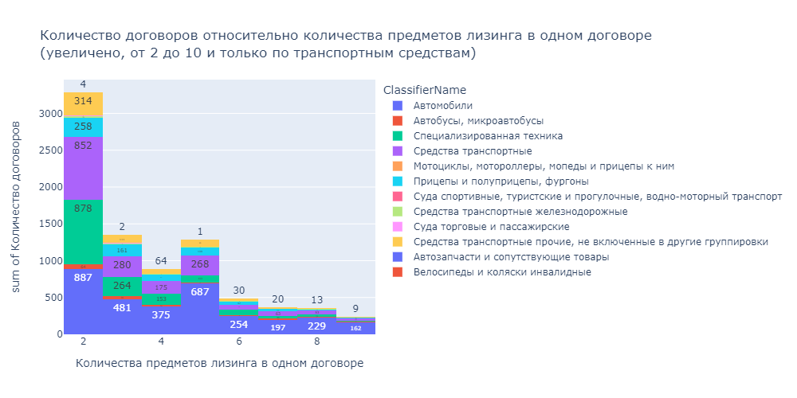

## ОТЧЕТ ПО ИССЛЕДОВАНИЮ ТАБЛИЦ ФЕДЕРАЛЬНОГО РЕСУРСА EFRSFDUL БАЗЫ ДАННЫХ VLS-MDM-DB MDM_MAIN

Первичное исследование таблиц Федерального ресурса  efrsfdul базы данных VLS-MDM-DB MDM_Main проведено в файлах exploratory_efrsfdul_part1.ipynb, exploratory_efrsfdul_part2.ipynb.

Данные MDM федерального ресурса представлены в 4 таблицах:  
-  financialleasecontract - таблица контрактов
-  financialleasecontractlessees - таблица лизингополучателей
-  financialleasecontractlessors - таблица лизингодателей
-  financialleasecontractobject -  таблица предметов лизинга
Для расшифровки поля нужно пользоваться Классификатор имущества.xlsx 

Обновление указанных таблиц производится ежедневно.

Выявлено: 
- на 1 договор может быть несколько предметов лизинга (34760 таких договоров)
- на 1 договор несколько лизингополучателей, таких 339 различных ИНН, похоже, что входят в группу. Таких договоров 1065
- на 1 договор несколько лизингодателей, но таких всего 8 ИНН, 43 договора

Дубли по лизингодателям и лизингополучателям лизингополучателям в рамках предобработки удаляются. 
ИНН имеют правильный формат во всех таблицах, не нуждаются в предварительной обработке.
Примеры и структура данных в этих таблицах представлены ниже в таблицах

**Таблица 1. Пример записей в таблице контрактов financialleasecontract**

|    | Id                                   | SessionId                            | CreatedOn           | ModifiedOn          |   new_kreditmessage_number | new_kreditmessage_date   | new_kreditmessage_type     | new_leasingcontract_number   | new_leasingcontract_date   | new_leasing_startdate   | new_leasing_enddate   |   new_sublease_agreement_sign | new_contractnumber   | new_activeondate   |   new_changemessage_publishe_number | new_terminationleasing_date   | new_terminationleasing_reason   | new_contract_status   |   ControlSum | IsLoadedToCrm   |
|---:|:-------------------------------------|:-------------------------------------|:--------------------|:--------------------|---------------------------:|:-------------------------|:---------------------------|:-----------------------------|:---------------------------|:------------------------|:----------------------|------------------------------:|:---------------------|:-------------------|------------------------------------:|:------------------------------|:--------------------------------|:----------------------|-------------:|:----------------|
|  0 | c5ba2a80-22db-eb11-b806-005056b4cb97 | d745ed11-15db-eb11-b806-005056b4cb97 | 2021-07-02 13:44:47 | 2021-07-02 13:44:47 |                    2921408 | 2018-01-10 14:12:03      | StopFinancialLeaseContract | 11/1*                       | 2012-06-07 00:00:00        | 2012-06-07 00:00:00     | 2013-01-31 00:00:00   |                             2 |                      |                    |                            01019939 | 2013-01-09 00:00:00           | плановый выкуп                  | Архивный              |   2713260586 | True            |

**Таблица 2. Пример записей в таблице лизингополучателей financialleasecontractlessees**

|    | Id                                   | SessionId                            | CreatedOn           | ModifiedOn          |   new_kreditmessage_number | new_lessee_type                | new_lessee_name                 |   new_lessee_inn |   new_lessee_ogrn | new_accountid                        | ControlSum   | IsLoadedToCrm   |
|---:|:-------------------------------------|:-------------------------------------|:--------------------|:--------------------|---------------------------:|:-------------------------------|:--------------------------------|-----------------:|------------------:|:-------------------------------------|:-------------|:----------------|
|  0 | f800e6c7-9fdc-eb11-b806-005056b4cb97 | d745ed11-15db-eb11-b806-005056b4cb97 | 2021-07-04 11:14:04 | 2021-07-04 11:14:04 |                    2921408 | LesseesIndividualEntrepreneurs | ФИО |     3525* |   3043* | 7b17104e-06c4-4f12-a4a1-bc96940cd1aa |              | False           |

**Таблица 3. Пример записей в таблице лизингодателей financialleasecontractlessors**

|    | Id                                   | SessionId                            | CreatedOn           | ModifiedOn          |   new_kreditmessage_number | new_creditor_type   | new_creditor_name   |   new_creditor_inn |   new_creditor_ogrn | new_accountid   | ControlSum   | IsLoadedToCrm   |
|---:|:-------------------------------------|:-------------------------------------|:--------------------|:--------------------|---------------------------:|:--------------------|:--------------------|-------------------:|--------------------:|:----------------|:-------------|:----------------|
|  0 | f700e6c7-9fdc-eb11-b806-005056b4cb97 | d745ed11-15db-eb11-b806-005056b4cb97 | 2021-07-04 11:14:04 | 2021-07-04 11:14:04 |                    2921408 | LessorsCompanies    | ООО "*"  |         3525* |       1123* |                 |              | False           |

**Таблица 4. Пример записей в таблице предметов лизинга financialleasecontractobject**

|    | Id                                   | SessionId                            | CreatedOn           | ModifiedOn          |   New_kreditmessage_number | new_leasingsubject_guid              | new_leasingsubjectid   |   new_leasingsubject_code | new_leasedassetsclass   | new_leasingsubject                                                                                                                                                                                                                                                                                                                                                                                                                                                                                                                          |   ControlSum | IsLoadedToCrm   |
|---:|:-------------------------------------|:-------------------------------------|:--------------------|:--------------------|---------------------------:|:-------------------------------------|:-----------------------|--------------------------:|:------------------------|:--------------------------------------------------------------------------------------------------------------------------------------------------------------------------------------------------------------------------------------------------------------------------------------------------------------------------------------------------------------------------------------------------------------------------------------------------------------------------------------------------------------------------------------------|-------------:|:----------------|
|  0 | f900e6c7-9fdc-eb11-b806-005056b4cb97 | d745ed11-15db-eb11-b806-005056b4cb97 | 2021-07-04 11:14:04 | 2021-07-04 11:14:04 |                    2921408 | 9c70b704-10ab-4ff2-a623-77d13b3a1a8c | Автомобиль Fiat DUCATO |                   0106008 | Автомобили              | Автомобиль Fiat DUCATO:(VIN) \*S040532Тип ТС: грузовой фургонГод изг.: 2012Двигатель : \*0481C \*83\* Кузов №: \*BS040\* Шасси № отсутствуетЦвет: белыйМощность двигателя: 110 (81)Рабочий объем дв.(куб. см): 2286Тип дв.: дизельныйРазрешенная макс масса, кг.: 3500Масса без нагрузки, кг.: 2070Организация-изготовитель: ООО «СОЛЛЕРС-ЕЛАБУГА» (РОССИЯ)ПТС 16 НК 430068 выдан 10.05.2012г. ООО «СОЛЛЕРС-ЕЛАБУГА», 423600, РТ, Елабужский муниципальный район, г. Елабуга, Территория ОЭЗ «Алабуга», ул. Ш-2, корп. 1/1 |   \*76506\* | False           |

#### АНАЛИЗ КОЛИЧЕСТВА ПРЕДМЕТОВ ЛИЗИНГА НА ОДИН ДОГОВОР
В одном договоре может быть несколько предметов лизинга. num_pl_total - посчитанное количество предметов лизинга. ПЛ_в_договоре_по_типам - посчитанное количество предметов лизинга в одном договоре в разрезе типа классификации. Значение num_pl_total может быть неинформативно, так как в рамках одного договора может быть 3 автомобиля, пример такого случая представлен в таблице 5 .  
**Таблица 5. Пример договора с 3 автомобилями**

|    |   new_kreditmessage_number | new_leasingsubject                              | new_leasingsubjectid   | ClassifierName   |   num_pl_total |   ПЛ_в_договоре_по_типам |
|---:|---------------------------:|:------------------------------------------------|:-----------------------|:-----------------|---------------:|-------------------------:|
|  0 |                    1199997 | Самосвал УРАЛ-55571-\*-60М, Россия, 2016 г.в. | \*555710G14\*      | Автомобили       |              3 |                        3 |
|  1 |                    1199997 | Самосвал УРАЛ-55571-\*-60М, Россия, 2016 г.в. | \*P555710G141\*     | Автомобили       |              3 |                        3 |
|  2 |                    1199997 | Самосвал УРАЛ-55571-\*-60М, Россия, 2016 г.в. | \*55710G141\*      | Автомобили       |              3 |                        3 |

		
А могут быть разные типы в одном договоре (см. таблицу 6 )   
**Таблица 6. Пример договора с разными типами предметов лизинга**

|    |   new_kreditmessage_number | new_leasingsubject                                                                                                                                                                                                                                                                                                                                                                                                               | new_leasingsubjectid                               | ClassifierName                                   |   num_pl_total |   ПЛ_в_договоре_по_типам |
|---:|---------------------------:|:---------------------------------------------------------------------------------------------------------------------------------------------------------------------------------------------------------------------------------------------------------------------------------------------------------------------------------------------------------------------------------------------------------------------------------|:---------------------------------------------------|:-------------------------------------------------|---------------:|-------------------------:|
|  0 |                    1025531 | (VIN) \*5LE07845\*Тип ТС: грузовой Категория ТС: ВГод изг.: 2014Двигатель: K7M, UA37761Кузов №: \*FS015LE078\*Шасси №: отсутствуетЦвет: серебристыйМощность двигателя: 84.3 л.с (62.0кВт)Рабочий объем дв.(куб. см): 1598Тип дв.: бензиновыйРазрешенная макс масса, кг: 2010Масса без нагрузки, кг: 1260Организация-изготовитель: ОАО «АВТОВАЗ» (Российская Федерация)ПТС 63 НХ 197631 выдан 04.01.2014 г. ОАО «АВТОВАЗ» | Автомобиль LADA, FS01\* LADA LARGUS                | Автомобили                                       |              2 |                        1 |
|  1 |                    1025531 | Колонка дизельная CUBE 70 MC, PIUSI S.p.A., 2014 г., Италия,                                                                                                                                                                                                                                                                                                                                                                     | Колонка дизельная CUBE 70 MC, PIUSI S.p.A., 2014 г | Оборудование, машины, инструмент и комплектующие |              2 |                        1 |

		
В таблице 7 показывается среднее и общее количество предметов лизинга в одном договоре. Из нее видно, что среднее количество автомобилей в одном договоре составляет 1.18 штук.    

**Таблица 7.Среднее и общее количество предметов лизинга в одном договоре**

|    |   new_leasingsubject_code | ClassifierName                                                                                                                                                                                        |   max предметов в договоре |   mean предметов в договоре |
|---:|--------------------------:|:------------------------------------------------------------------------------------------------------------------------------------------------------------------------------------------------------|---------------------------:|----------------------------:|
|  0 |                   0000010 | Недвижимость                                                                                                                                                                                          |                          1 |                        1    |
|  1 |                        01 | Материальные активы                                                                                                                                                                                   |                      12815 |                        8.19 |
|  2 |                      0101 | Завершенные здания и сооружения или их части                                                                                                                                                          |                         15 |                        1.39 |
|  3 |                   0101001 | Здания и сооружения топливно-энергетических, металлургических, химических и нефтехимических предприятий                                                                                               |                          1 |                        1    |
|  4 |                   0101003 | Здания и сооружения предприятий лесной, деревообрабатывающей, целлюлозно-бумажной, стекольной, фарфоро-фаянсовой, полиграфической промышленности и предприятий промышленности строительных материалов |                          1 |                        1    |
|  5 |                   0101004 | Здания предприятий легкой, пищевой, микробиологической, мукомольно-крупяной, комбикормовой и медицинской промышленности                                                                               |                          1 |                        1    |
|  6 |                   0101005 | Здания и сооружения сельскохозяйственных предприятий и предприятий лесного хозяйства                                                                                                                  |                          1 |                        1    |
|  7 |                   0101006 | Здания и сооружения предприятий строительной индустрии, транспорта и связи                                                                                                                            |                          1 |                        1    |
|  8 |                   0101007 | Здания и сооружения предприятий торговли, общественного питания, жилищно-коммунального хозяйства                                                                                                      |                          1 |                        1    |
|  9 |                   0101011 | Сооружения - металлические конструкции. Сооружения хозяйственные металлические                                                                                                                        |                          6 |                        1.29 |
| 10 |                   0101014 | Незавершенное строительство                                                                                                                                                                           |                          1 |                        1    |
| 11 |                   0101015 | Здания (кроме жилых) и сооружения, не включенные в другие группировки                                                                                                                                 |                        109 |                       46.2  |
| 12 |                   0101016 | Жилые здания (помещения)                                                                                                                                                                              |                          1 |                        1    |
| 13 |                   0101017 | Здания (помещения) жилые, не входящие в жилищный фонд                                                                                                                                                 |                          1 |                        1    |
| 14 |                      0102 | Предприятия, как имущественный комплекс                                                                                                                                                               |                          1 |                        1    |
| 15 |                      0103 | Незавершенное строительство - конструкции, сооружения, здания                                                                                                                                         |                          2 |                        1.07 |
| 16 |                      0104 | Оборудование, машины, инструмент и комплектующие                                                                                                                                                      |                       4300 |                        1.96 |
| 17 |                   0104001 | Вентиляционное и климатическое оборудование                                                                                                                                                           |                         11 |                        1.61 |
| 18 |                   0104002 | Грузоподъемное оборудование и комплектующие                                                                                                                                                           |                         61 |                        1.16 |
| 19 |                   0104003 | Измерительное оборудование, инструмент и комплектующие                                                                                                                                                |                       8333 |                       28.13 |
| 20 |                   0104004 | Клининговое оборудование, комплектующие, инструмент                                                                                                                                                   |                         13 |                        1.68 |
| 21 |                   0104005 | Компьютерное оборудование, комплектующие и программное обеспечение                                                                                                                                    |                       4220 |                        9.41 |
| 22 |                   0104006 | Котельное оборудование, инструмент, комплектующие                                                                                                                                                     |                          8 |                        1.19 |
| 23 |                   0104007 | Медицинское оборудование, комплектующие и инструмент                                                                                                                                                  |                         38 |                        1.63 |
| 24 |                   0104008 | Металлообрабатывающее оборудование, комплектующие, инструмент                                                                                                                                         |                         18 |                        1.21 |
| 25 |                   0104009 | Насосное оборудование, комплектующие, сопутствующие                                                                                                                                                   |                         16 |                        2.04 |
| 26 |                   0104010 | Оборудование для предприятий общественного питания, комплектующие и инструмент                                                                                                                        |                         59 |                        1.57 |
| 27 |                   0104011 | Оборудование, комплектующие и инструмент для ремонта и обслуживания транспорта                                                                                                                        |                        100 |                        1.64 |
| 28 |                   0104012 | Офисная техника, оргтехника и комплектующие                                                                                                                                                           |                          8 |                        1.19 |
| 29 |                   0104013 | Пожарно-охранное оборудование, комплектующие и инструмент                                                                                                                                             |                          2 |                        1.03 |
| 30 |                   0104014 | Полиграфическое оборудование, комплектующие и инструмент                                                                                                                                              |                          8 |                        1.14 |
| 31 |                   0104015 | Производственное, промышленное оборудование, комплектующие и инструмент                                                                                                                               |                        365 |                        1.66 |
| 32 |                   0104016 | Санитарно-техническое оборудование, комплектующие и инструмент                                                                                                                                        |                          1 |                        1    |
| 33 |                   0104017 | Спортивное, косметологическое оборудование, комплектующие                                                                                                                                             |                         73 |                        4.44 |
| 34 |                   0104018 | Средства связи, комплектующие и инструмент                                                                                                                                                            |                          8 |                        1.26 |
| 35 |                   0104019 | Строительно-отделочное оборудование, комплектующие и инструмент                                                                                                                                       |                         14 |                        1.1  |
| 36 |                   0104020 | Торгово-складское оборудование, инструмент и комплектующие                                                                                                                                            |                         56 |                        1.46 |
| 37 |                   0104021 | Электрооборудование, комплектующие и инструмент                                                                                                                                                       |                         12 |                        1.9  |
| 38 |                   0104022 | Электродвигатели, генераторы и трансформаторы силовые                                                                                                                                                 |                         25 |                        1.45 |
| 39 |                   0104023 | Машины и оборудование прочие, не включенные в другие группировки                                                                                                                                      |                        900 |                        6.42 |
| 40 |                   0104024 | Оружие спортивное, охотничье и военная техника двойного применения                                                                                                                                    |                          1 |                        1    |
| 41 |                   0104025 | Техника электронно-вычислительная                                                                                                                                                                     |                          3 |                        1.04 |
| 42 |                   0104026 | Приборы для научных исследований                                                                                                                                                                      |                          2 |                        1.09 |
| 43 |                      0105 | Инвентарь производственный и хозяйственный, приборы бытовые                                                                                                                                           |                          5 |                        1.1  |
| 44 |                   0105001 | Мебель специальная для производств                                                                                                                                                                    |                          1 |                        1    |
| 45 |                   0105002 | Приборы бытовые                                                                                                                                                                                       |                         16 |                       16    |
| 46 |                   0105005 | Инвентарь спортивный                                                                                                                                                                                  |                          1 |                        1    |
| 47 |                   0105008 | Тара функциональная, емкости, контейнеры                                                                                                                                                              |                         78 |                        3.36 |
| 48 |                   0105009 | Инвентарь хозяйственно-бытового назначения                                                                                                                                                            |                          7 |                        3    |
| 49 |                      0106 | Средства транспортные                                                                                                                                                                                 |                        220 |                        1.61 |
| 50 |                   0106001 | Мотоциклы, мотороллеры, мопеды и прицепы к ним                                                                                                                                                        |                         47 |                        1.31 |
| 51 |                   0106002 | Аппараты летательные космические                                                                                                                                                                      |                          1 |                        1    |
| 52 |                   0106003 | Велосипеды и коляски инвалидные                                                                                                                                                                       |                          5 |                        1.53 |
| 53 |                   0106004 | Прицепы и полуприцепы, фургоны                                                                                                                                                                        |                        432 |                        2.15 |
| 54 |                   0106005 | Суда спортивные, туристские и прогулочные, водно-моторный транспорт                                                                                                                                   |                          2 |                        1.02 |
| 55 |                   0106006 | Средства транспортные железнодорожные                                                                                                                                                                 |                       4500 |                      290.8  |
| 56 |                   0106007 | Аппараты летательные воздушные                                                                                                                                                                        |                          1 |                        1    |
| 57 |                   0106008 | Автомобили                                                                                                                                                                                            |                       1500 |                        1.18 |
| 58 |                   0106009 | Суда торговые и пассажирские                                                                                                                                                                          |                         11 |                        2.36 |
| 59 |                   0106010 | Средства транспортные прочие, не включенные в другие группировки                                                                                                                                      |                        425 |                        1.55 |
| 60 |                   0106011 | Автобусы, микроавтобусы                                                                                                                                                                               |                        400 |                        1.61 |
| 61 |                   0106012 | Автозапчасти и сопутствующие товары                                                                                                                                                                   |                          3 |                        1.13 |
| 62 |                   0106013 | Специализированная техника                                                                                                                                                                            |                         59 |                        1.1  |
| 63 |                      0107 | Животноводство. Растениеводство                                                                                                                                                                       |                          1 |                        1    |
| 64 |                   0107009 | Корма растительные                                                                                                                                                                                    |                          4 |                        4    |
| 65 |                   0108001 | Земельные участки                                                                                                                                                                                     |                          1 |                        1    |
| 66 |                   0109006 | Материалы для упаковки и хранения                                                                                                                                                                     |                          1 |                        1    |
| 67 |                   0109008 | Полимерные материалы и изделия. Асбестотехнические изделия                                                                                                                                            |                          2 |                        1.33 |
| 68 |                   0109009 | Строительные материалы кроме железобетонных конструкций                                                                                                                                               |                          1 |                        1    |
| 69 |                   0109016 | Продукция лесозаготовительной и лесопильно-деревообрабатывающей промышленности, фанерного производства                                                                                                |                          1 |                        1    |
| 70 |                   0110001 | Аудио-видео-фото техника и комплектующие                                                                                                                                                              |                          1 |                        1    |
| 71 |                   0110008 | Мебель и комплектующие                                                                                                                                                                                |                          4 |                        1.11 |
| 72 |                   0110022 | Продукция пищевой промышленности. Продукция мясной, молочной, рыбной, мукомольно-крупяной, комбикормовой и микробиологической промышленности                                                          |                          1 |                        1    |
| 73 |                        02 | Нематериальные активы                                                                                                                                                                                 |                          6 |                        1.25 |
| 74 |                   0202002 | Системные и прикладные программные средства                                                                                                                                                           |                          1 |                        1    |
| 75 |                        03 | Финансовые активы                                                                                                                                                                                     |                        845 |                        8.64 |
| 76 |                        04 | Имущественные права                                                                                                                                                                                   |                         62 |                        1.36 |
| 77 |                    042922 | Прочие водные транспортные средства                                                                                                                                                                   |                          1 |                        1    |
| 78 |                        99 | Прочее                                                                                                                                                                                                |                        150 |                        2.9  |

		
Более подробно распределение количества договоров, содержащих от двух до десяти транспортных средства представлены на рисунке ниже.  

Доля договоров с транспортными средствами (коды 0106), имеющими более одного предмета лизинга в рамках одного договора, составляет 1.66%. Из-за невысокой доли таких договоров принято решение множественные строки по предметам лизинга в одном договоре удалять, тем более что на один договор может быть 1000-3000 предметов лизинга с типом материальные запасы, что неравнозначно 3000 договоров с типом транспортное средство. Строки с несколькими предметами лизинга удаляются таким образом, чтобы оставалась одна запись с наивысшим приоритетом. Приоритет отдается сначала автомобилям или автобусам, далее транспортным средствам, потом все остальные типы в произвольном порядке. Результат удаления данных показан в таблице 8.

**Таблица 8. Данные по договору с new_kreditmessage_number = 1473148**   
**Исходные данные:**

|    |   new_kreditmessage_number | new_leasingsubject_guid              |   new_leasingsubject_code | new_leasingsubject              | ClassifierName                 |   num_pl_total |   ПЛ_в_договоре_по_типам |
|---:|---------------------------:|:-------------------------------------|--------------------------:|:--------------------------------|:-------------------------------|---------------:|-------------------------:|
|  0 |                    1473148 | 89aacccb-243b-4700-ae5b-f44dd16ae31e |                   0106004 | Самосвальный полуприцеп - 3 ед. | Прицепы и полуприцепы, фургоны |              2 |                        1 |
|  1 |                    1473148 | 885494ce-2213-4eab-ab00-2a0368348b82 |                   0106008 | Тягач седельный - 3ед.          | Автомобили                     |              2 |                        1 |

**После удаления дублей:**

|    |   new_kreditmessage_number | new_leasingsubject_guid              |   new_leasingsubject_code | new_leasingsubject     | ClassifierName   |   num_pl_total |   ПЛ_в_договоре_по_типам |
|---:|---------------------------:|:-------------------------------------|--------------------------:|:-----------------------|:-----------------|---------------:|-------------------------:|
|  0 |                    1473148 | 885494ce-2213-4eab-ab00-2a0368348b82 |                   0106008 | Тягач седельный - 3ед. | Автомобили       |              2 |                        1 |

Возможно, имеет смысл анализ в дальнейшем вести только по транспортным средствам (код 0106). На сегодняшний день договоры со всеми типами предметов лизинга сохраняются. 
Значение num_pl_total после удаления строк с несколькими предметами лизинга позволяет определить сколько было строк в таблице financialleasecontractobject изначально по этому договору. 
В поле new_leasingsubject_code в таблице financialleasecontractobject частично пропущены лидирующие 0, поэтому для дальнейшей обработки лидирующие нули вставлены везде, где необходимо. 
Поля new_leasingsubject_code и new_leasedassetsclass не имеют взаимно однозначного соответствия. Поле new_leasedassetsclass набивается произвольно, имеет ошибки, например, Материальныеактивы. Одно значение "оборудования" попало в группу судов. в справочнике 0106009 соответствует "Суда торговые и пассажирские".
Таким образом, для отчетов необходимо пользоваться new_leasingsubject_code, а для расшифровки этого поля, нужно пользоваться справочником Фед ресурса, например, https://fedresurs.ru/helps/Sfacts/MessageContent_1.8.pdf?attempt=1
Для дальнейшего анализа вставлено поле ClassifierName из данных справочника фед ресурса для расшифровки поля. см таблицу 5.

#### СТРУКТУРА ЗАПИСЕЙ ПО ДОГОВОРУ В ТАБЛИЦЕ FINANCIALLEASECONTRACT
При изменении данных по договору в таблицу financialleasecontract добавляется строка с измененными значениями. Первичное сообщение о заключении договора имеет значение поле new_kreditmessage_type равным FinancialLeaseContract, сообщение об изменении — ChangeFinancialLeaseContract, а сообщение о закрытии — StopFinancialLeaseContract. Пример в таблицах 9  и 10.

**Таблица 9. Данные по договору \*516/06-21 ВЛМ**

|   new_lessee_inn | new_leasingcontract_date   | new_leasingcontract_number   | new_kreditmessage_type       |   new_kreditmessage_number | new_changemessage_publishe_number   | new_kreditmessage_date   | new_leasing_startdate   | new_leasing_enddate   | new_terminationleasing_date   | new_terminationleasing_reason   | new_contract_status   |
|-----------------:|:---------------------------|:-----------------------------|:-----------------------------|---------------------------:|:------------------------------------|:-------------------------|:------------------------|:----------------------|:------------------------------|:--------------------------------|:----------------------|
|       \*847 | 2021-06-15 00:00:00        |\*516/06-21 ВЛМ       | FinancialLeaseContract       |                    8828640 |                                     | 2021-07-08 21:04:08      | 2021-07-06 00:00:00     | 2023-01-31 00:00:00   | NaT                           |                                 | Действующий           |
|     \*1668 | 2021-06-15 00:00:00        | \*516/06-21 ВЛМ         | ChangeFinancialLeaseContract |                   12117741 | 08828640                            | 2022-05-06 11:24:19      | 2021-06-15 00:00:00     | 2023-01-31 00:00:00   | NaT                           |                                 | Действующий           |
|     \*1668 | 2021-06-15 00:00:00        | \*516/06-21 ВЛМ         | StopFinancialLeaseContract   |                   12631587 | 12117741                            | 2022-06-29 14:33:02      | NaT                     | NaT                   | 2022-06-28 00:00:00           | Договор закрыт                  | Архивный              |

**Таблица 10. Данные по договору \*57/06-22 ВРЖ**

Из 1с:
| Контрагент        |        ИНН | Номер договора     | Дата договора       | Дата приложения от   | Срок приложения до   | Статус приложения   | Дата лизинга        | Документ завершения               | Примечание к завершению   |
|:------------------|-----------:|:-------------------|:--------------------|:---------------------|:---------------------|:--------------------|:--------------------|:----------------------------------|:--------------------------|
| ООО \*   | \*4404 | \*57/06-22 ВРЖ | 2022-02-15 00:00:00 | 2022-02-15 00:00:00  | 2022-06-30 00:00:00  | Закрыт              | 2022-02-25 00:00:00 | Реструктуризация договора лизинга | Перенайм                  |
| Фирма \* | 970513\* | \*57/06-22 ВРЖ | 2022-02-15 00:00:00 | 2022-07-01 00:00:00  | 2022-09-30 00:00:00  | Закрыт              | 2022-07-01 00:00:00 | Акт возврата из лизинга           |                           |

из базы efrsfdul:

|   new_lessee_inn | new_leasingcontract_date   | new_leasingcontract_number   | new_kreditmessage_type       |   new_kreditmessage_number | new_changemessage_publishe_number   | new_kreditmessage_date   | new_leasing_startdate   | new_leasing_enddate   | new_terminationleasing_date   | new_terminationleasing_reason   | new_contract_status   |
|-----------------:|:---------------------------|:-----------------------------|:-----------------------------|---------------------------:|:------------------------------------|:-------------------------|:------------------------|:----------------------|:------------------------------|:--------------------------------|:----------------------|
|       3662184404 | 2022-02-15 00:00:00        | \*57/06-22 ВРЖ          | FinancialLeaseContract       |                   11334701 |                                     | 2022-02-28 16:21:24      | 2022-02-25 00:00:00     | 2026-01-31 00:00:00   |                               |                                 | Действующий           |
|       9705137113 | 2022-02-15 00:00:00        | \*57/06-22 ВРЖ           | ChangeFinancialLeaseContract |                   12764174 | 11334701                            | 2022-07-13 15:08:08      | 2022-02-15 00:00:00     | 2026-01-31 00:00:00   |                               |                                 | Действующий           |
|       9705137113 | 2022-02-15 00:00:00        | \*57/06-22 ВРЖ          | ChangeFinancialLeaseContract |                   14125419 | 12764174                            | 2022-12-09 14:09:26      | 2022-02-15 00:00:00     | 2022-09-30 00:00:00   |                               |                                 | Архивный              |

Из примера по договору \*57/06-22 ВРЖ (см таблицу  10) видно, что при закрытии договора не всегда формируется запись с типом StopFinancialLeaseContract, может закончится записью с ChangeFinancialLeaseContract с проставленными новыми датами окончания и в поле new_contract_status записано значение «Архивный»

Было рассчитано поле origin_by_message, равное new_kreditmessage_number у самой первой записи по договору, позволяющее определять все записи, относящиеся к одному договору. Пример представлен в таблице 11.

**Таблица 11. Данные по договору /*326/03-20 СПБ. Пример вычисления origin_by_message**   

|   new_lessee_inn |   origin_by_message | new_leasingcontract_date   | new_leasingcontract_number   | new_kreditmessage_type       |   new_kreditmessage_number | new_changemessage_publishe_number   | new_kreditmessage_date   | new_leasing_startdate   | new_leasing_enddate   | new_terminationleasing_date   | new_terminationleasing_reason   | new_contractnumber   |
|-----------------:|--------------------:|:---------------------------|:-----------------------------|:-----------------------------|---------------------------:|:------------------------------------|:-------------------------|:------------------------|:----------------------|:------------------------------|:--------------------------------|:---------------------|
|       \*875 |             5639777 | 2020-11-20 00:00:00        | \*326/03-20 СПБ          | FinancialLeaseContract       |                    5639777 |                                     | 2020-11-24 10:34:55      | 2020-11-22 00:00:00     | 2023-10-31 00:00:00   |                               |                                 |                      |
|       \*785 |             5639777 | 2020-11-20 00:00:00        | \*326/03-20 СПБ          | ChangeFinancialLeaseContract |                   12044325 | 05639777                            | 2022-04-26 17:25:36      | 2020-11-20 00:00:00     | 2023-10-31 00:00:00   |                               |                                 |                      |
|       \*160 |             5639777 | 2020-11-20 00:00:00        | \*326/03-20 СПБ          | ChangeFinancialLeaseContract |                   12178446 | 12044325                            | 2022-05-11 14:15:01      | 2020-11-20 00:00:00     | 2023-10-31 00:00:00   |                               |                                 |                      |

#### Поле new_terminationleasing_reason в таблице financialleasecontract
Поле new_terminationleasing_reason в таблице financialleasecontract имеет текстовый формат. Его обработка позволила выде-лить следующие группы причин завершения приложений (поле reason):
•	завершение 
•	расторгнут
•	отмена
•	страховой случай
•	страховой случай (гибель/тотал)
•	замена/перенайм/переуступка
•	гибель/тотал
И еще одна категория «определена цессия» была вычислена, как наличие передачи другому лизингополучателю.
Пример таких значений представлен в таблице 12.

**Таблица 12. Примеры распарсивания причин закрытия договора**

| new_kreditmessage_type     | new_leasingcontract_number | new_terminationleasing_reason                                                                                  | new_contract_status | reason                          |
| -------------------------- | -------------------------- | -------------------------------------------------------------------------------------------------------------- | ------------------- | ------------------------------- |
| StopFinancialLeaseContract | \*548-СПБ-\*                | Закрытие в связи с наступлением страхового случая "угон".                                                      | Архивный            | страховой случай                |
| StopFinancialLeaseContract | \*779-МСК-\*                 | расторжение договора в связи с ТОТАЛом                                                                         | Архивный            | гибель/тотал                    |
| StopFinancialLeaseContract | \*460-МСК-\*                 | ДЛ расторгнут, ТС изъят                                                                                        | Архивный            | расторгнут                      |
| StopFinancialLeaseContract | \*62/11111\*                 | В связи со страховым случаем (тотальная гибель Транспортного средства)                                         | Архивный            | страховой случай (гибель/тотал) |
| StopFinancialLeaseContract | \*9-0062\*                   | Данные по договору переданы ошибочно, договор не состоялся.ТС лизингополучателю не передавался.                | Архивный            | отмена                          |
| StopFinancialLeaseContract | \*3/17/\*                    | Замена стороны по договору лизинга.                                                                            | Архивный            | замена/перенайм/переуступка     |
| StopFinancialLeaseContract | \*58-\*                      | В связи с заключением соглашения об уступке прав по Договору лизинга №4458-А от 13.03.2019 г.                  | Архивный            | замена/перенайм/переуступка     |
| StopFinancialLeaseContract | \*-266/\*                    | В связи с досрочным выкупом                                                                                    | Архивный            | завершение                      |
| StopFinancialLeaseContract | \*003\*                      | Договор расторгнут 21.05.2021 в связи с конструктивной гибелью Предмета лизинга                                | Архивный            | гибель/тотал                    |
| StopFinancialLeaseContract | \*49\*                       | ДЛ не был реализован, клиент отказался от сделки                                                               | Архивный            | отмена                          |
| StopFinancialLeaseContract | \*1220/О\*                   | В связи с истечением срока действия Договора финансовой аренды (лизинга) № 131220/ОБ от «08» декабря 2020 года | Архивный            | завершение                      |
| StopFinancialLeaseContract | \*IA/MSC-01906/\*            | Досрочное закрытие договора финансовой аренды (лизинга), в связи со страховым случаем                          | Архивный            | страховой случай                |
|                            |                            |                                                                                                                |                     |                                 |

### Скрытые поля таблицы лизингодателей financialleasecontractlessors
В случае, если в отношении компаний-публикаторах введены меры ограничительного характера, и сведения о таких лицах не подлежат размещению в информационно-телекоммуникационной сети "Интернет", в поле publisher_data_fullName указывается строка «Сведения скрыты в соответствии с требованиями постановления Правительства РФ от 12.01.2018 г. №5», поля publisher_data_inn и publisher_data_ogrn при этом не заполнены. 
Это накладывает ограничение на подсчет количества и определение других лизингодателей, с которыми заключены договоры у нашего клиента. Все лизинговые компании с государственным участием будут считаться за один лизингодатель. Возможным ва-риантом выделения таких лизингодателей — учитывать их аббревиатуры нумераций договоров. 
 

